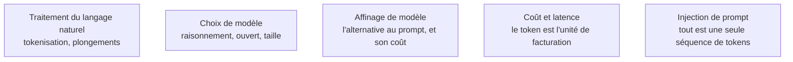

Niveau attendu : **autonomie**. On attend d'un confirmé qu'il explique sous pression pourquoi la même consigne se comporte autrement d'un modèle à l'autre, et pas seulement qu'il le constate — la référence, sur ce qui se passe sous le capot, appartient à qui entraîne les modèles, pas à qui les appelle.

Un prompt n'est pas une incantation : c'est le préfixe qui conditionne une distribution de probabilité sur le prochain token. Presque tout ce qui surprend au début découle de cette phrase.

## Ce que le modèle fait, et ce qu'il ne fait pas

Un LLM est un transformer décodeur entraîné à prédire le token suivant, puis aligné par post-entraînement. C'est l'alignement, pas le pré-entraînement, qui explique qu'il obéisse à une instruction. À l'inférence, les poids sont figés : aucun prompt ne modifie le modèle, il ne fait que déplacer le point de départ de l'échantillonnage.

Trois conséquences pratiques. Le modèle produit toujours une continuation plausible et n'a pas de mode « je ne sais pas » natif — on le lui donne explicitement, ou on ancre la réponse sur des sources. Il n'a accès qu'à ce qui tient dans sa fenêtre de contexte, et la fenêtre annoncée n'est pas la fenêtre utile. Enfin, il ne distingue pas structurellement une instruction d'une donnée : les deux arrivent sous forme de tokens, ce qui est la racine du problème traité dans [[parcours/prompt-engineering/securite-du-prompt|la page sécurité]].

Le token est aussi l'unité de facturation et de mesure : trois à quatre caractères en anglais, plutôt deux à trois en français. Un texte français coûte structurellement plus cher que son équivalent anglais, et les chiffres comme le code se tokenisent mal — d'où les erreurs arithmétiques historiques.

## Ce qu'il faut savoir faire

- **Expliquer sans notes** ce que sont un token, une fenêtre de contexte et une hallucination, et pourquoi les trois sont liés.
- **Arbitrer entre prompt et affinage** : le prompt change le comportement instantanément et à coût nul, l'affinage change le comportement par défaut et compresse le prompt. On n'affine qu'après avoir épuisé le prompting *et* constitué un jeu d'évaluation, jamais avant.
- **Situer un modèle sur le seul axe qui compte encore** : à raisonnement ou pas. Un modèle à raisonnement génère une trace interne avant de répondre, son budget de réflexion est un paramètre, sa latence explose et son coût se mesure en tokens invisibles.
- **Anticiper la dégradation sur modèle ouvert servi localement** : le suivi d'instructions complexes y est plus faible, et un prompt validé sur un modèle frontier ne s'y transpose pas tel quel.
- **Traiter chaque changement de modèle comme une migration**, avec rejeu du jeu d'évaluation. Un prompt est un artefact couplé à un modèle *et* à sa version.

> [!warning] Piège
> Croire qu'un prompt est portable. Les équipes qui ne versionnent pas le couple (prompt, modèle) découvrent leurs régressions en production, sur un changement de version qu'elles n'ont pas décidé.

## Les notions mobilisées

- [[notions/traitement-langage-naturel]] — tokenisation et plongements : ce que le modèle reçoit réellement quand on lui envoie du texte.
- [[notions/choix-de-modele]] — l'angle prompt engineering : le choix du modèle fixe ce que le prompt aura à compenser.
- [[notions/affinage-de-modele]] — la frontière exacte entre ce qui se règle par le prompt et ce qui justifie un entraînement.
- [[notions/cout-et-latence-inference]] — le prompt est facturé à chaque appel : sa longueur est une décision d'architecture.
- [[notions/injection-de-prompt]] — l'absence de séparation instruction/donnée, énoncée ici, exploitée là.

## Pour apprendre

- [Prompt Engineering](https://www.kaggle.com/whitepaper-prompt-engineering), Lee Boonstra (Google) — le livre blanc dont dérive l'essentiel du vocabulaire du domaine, à lire en premier et en entier.
- [Prompt Engineering Guide](https://www.promptingguide.ai/) (DAIR.AI) — panorama des techniques avec les références des papiers d'origine, tenu à jour.
- [Tiktokenizer](https://tiktokenizer.vercel.app/) — visualiser la tokenisation d'un texte : la manière la plus rapide de comprendre pourquoi le français coûte plus cher.
- [Let's build the GPT Tokenizer](https://www.youtube.com/watch?v=zduSFxRajkE), Andrej Karpathy — deux heures qui rendent définitivement concrète l'unité de facturation.
- [Documentation « Prompt engineering » d'Anthropic](https://docs.claude.com/en/docs/build-with-claude/prompt-engineering/overview) — la vue fournisseur, utile à confronter au guide OpenAI qui la contredit sur des détails de format.
