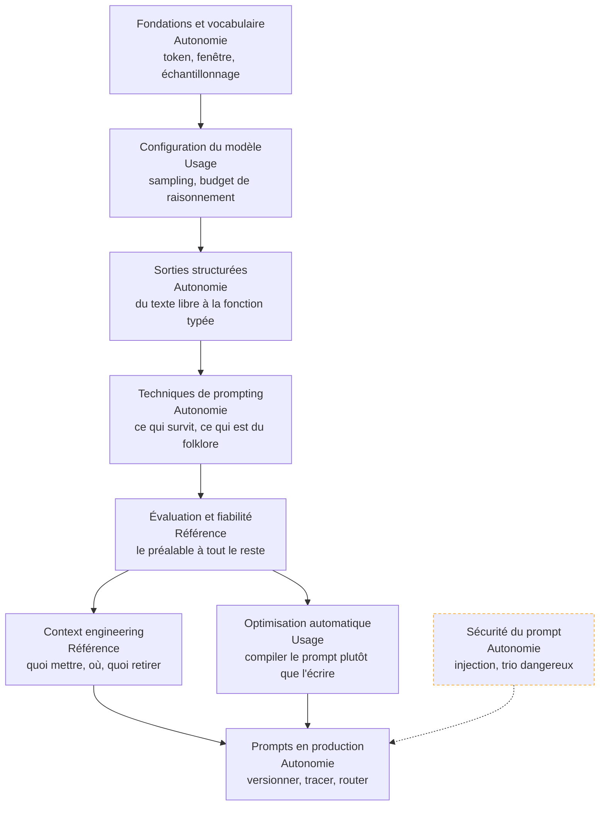

Écrire pour un modèle ce qu'on écrirait pour une machine : une instruction, un contexte choisi, un format contraint et une mesure qui dit si la dernière modification a amélioré quoi que ce soit.

## La roadmap

Chaque case mène à sa page et porte le niveau attendu chez un profil **confirmé** — de **notion** (reconnaître le sujet, savoir qui appeler) à **référence** (faire autorité dans la salle). Cochez les étapes acquises en bas de page pour suivre votre progression.

## Ma progression

- [ ] [[parcours/prompt-engineering/fondations-et-vocabulaire|Fondations et vocabulaire]] — ce qu'un modèle fait réellement, et pourquoi un prompt n'est pas portable
- [ ] [[parcours/prompt-engineering/configuration-du-modele|Configuration du modèle]] — les paramètres qui agissent sur la forme, et les deux qui comptent vraiment
- [ ] [[parcours/prompt-engineering/sorties-structurees|Sorties structurées]] — contraindre le décodage plutôt que demander poliment du JSON
- [ ] [[parcours/prompt-engineering/techniques-de-prompting|Techniques de prompting]] — lesquelles sont encore rentables sur un modèle à raisonnement
- [ ] [[parcours/prompt-engineering/evaluation-et-fiabilite|Évaluation et fiabilité]] — jeu de cas versionné, assertions, juge calibré, non-régression
- [ ] [[parcours/prompt-engineering/context-engineering|Context engineering]] — sélection, ordonnancement, compaction, isolation
- [ ] [[parcours/prompt-engineering/optimisation-automatique|Optimisation automatique des prompts]] — recherche guidée par la métrique, portabilité entre modèles
- [ ] [[parcours/prompt-engineering/securite-du-prompt|Sécurité du prompt]] — injection directe et indirecte, et ce qui relève de l'architecture
- [ ] [[parcours/prompt-engineering/prompts-en-production|Prompts en production]] — versionnement, traces, coût par requête, routage
