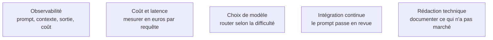

Prise une par une, chaque bonne pratique est évidente ; ce qui ne l'est pas, c'est de les tenir toutes sur un système vivant pendant un an.

## Les quatre pratiques qu'on saute, et qui font mal

**Versionner.** Un fichier de prompt par tâche, dans le dépôt, à côté du code, avec le modèle cible et le score d'évaluation associés. Un prompt sans version est une dette invisible : personne ne sait quelle formulation a produit les résultats de la semaine dernière.

**Documenter les échecs.** Le fichier le plus utile d'un projet fondé sur un modèle est celui qui liste ce qui a été essayé et n'a pas marché. Il évite au successeur — et à soi-même dans six mois — de refaire la même boucle.

**Tracer.** Capturer prompt, contexte, sortie et coût de chaque appel. C'est ce qui permet de reconstituer un incident, d'alimenter le jeu de cas et de constater qu'une requête sur dix coûte cent fois la médiane.

**Mesurer le coût.** Tokens d'entrée, de sortie et de raisonnement par requête, convertis en euros. Les leviers, par ordre de rentabilité : cache de prompt, réduction du contexte, modèle plus petit sur les étapes faciles, budget de raisonnement adapté à la difficulté.

Sur la forme, trois règles suffisent. La clarté bat la contrainte : « produis un résumé de trois phrases destiné à un décideur non technique » bat une liste de dix interdictions, les contraintes négatives étant mal suivies. Le prompt de production se relit **à la baisse** — chaque phrase inutile dilue le signal et se paie à chaque appel. Et un prompt est un **gabarit à variables**, pas une concaténation de chaînes : c'est ce qui le rend testable, comparable dans un diff et compilable.

## Ce qu'il faut savoir faire

- **Sortir les prompts du code applicatif** pour en faire des fichiers versionnés, revus et diffables, référencés par identifiant et version.
- **Instrumenter un appel de bout en bout** : entrée, contexte injecté, sortie, latence, coût, version de prompt et de modèle. Sans la version, une trace ne sert à rien.
- **Contraindre la longueur de sortie aux deux endroits** — dans le prompt (« trois phrases ») et dans l'API (`max_tokens`) —, jamais l'un seul.
- **Reformuler une interdiction en instruction positive** chaque fois que c'est possible, et vérifier le gain sur l'évaluation.
- **Mettre en place un routage entre modèles** : petit modèle pour la classification et l'extraction, modèle lourd pour le raisonnement, escalade sur signal d'échec — schéma invalide, confiance basse, refus. À ne faire qu'une fois l'évaluation solide, puisque le routage double la surface à évaluer.
- **Tenir un journal de décisions** qui dit pourquoi une règle a été ajoutée et quel cas de test la justifie.

> [!warning] Piège
> Le prompt système qui grossit par sédimentation. Chaque incident ajoute sa règle, personne n'en retire jamais, et au bout d'un an il fait quatre mille tokens dont la moitié se contredit. Une règle par incident au maximum, assortie du cas de test qui prouve qu'elle sert, et un élagage périodique de celles que l'évaluation ne justifie plus.

## Les notions mobilisées

- [[notions/observabilite]] — l'angle prompt engineering : une trace sans version de prompt ni version de modèle est ininterprétable.
- [[notions/cout-et-latence-inference]] — le coût par requête est une métrique de produit, suivie au même titre que la qualité.
- [[notions/choix-de-modele]] — le routage est le levier de coût le plus rentable, et le plus coûteux en évaluation.
- [[notions/integration-continue]] — un changement de prompt est un changement de code : revue, test, seuil de blocage.
- [[notions/redaction-technique]] — le journal des échecs et des décisions est un livrable, pas une note personnelle.

## Pour apprendre

- [Prompt engineering](https://platform.openai.com/docs/guides/prompt-engineering) (OpenAI) et [la documentation équivalente d'Anthropic](https://docs.claude.com/en/docs/build-with-claude/prompt-engineering/overview) — les deux se contredisent sur des détails de format, ce qui est en soi l'enseignement principal : mesure sur ton modèle.
- [What We Learned from a Year of Building with LLMs](https://applied-llms.org/) — le retour d'expérience collectif le plus dense sur la mise en production, section par section.
- [OpenTelemetry — Generative AI conventions](https://opentelemetry.io/docs/specs/semconv/gen-ai/) — la convention de nommage des traces d'appel de modèle, à adopter avant d'en inventer une.
- [Langfuse](https://langfuse.com/docs) — tracing, gestion de versions de prompts et suivi de coût, en source ouverte et auto-hébergeable.
