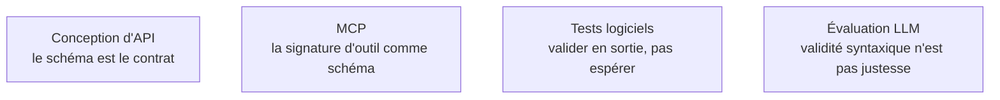

Une sortie structurée est ce qui transforme un modèle de langue en composant logiciel : tant que la sortie est de la prose, tout le code en aval est du parsing défensif.

## De la demande polie au décodage contraint

On ne demande plus du JSON, on le **contraint au décodage**. Trois voies, par ordre de préférence : le mode « sorties structurées » natif du fournisseur, où le schéma est garanti côté serveur ; le *tool calling*, où la signature de l'outil *est* le schéma ; les grammaires côté serveur local — Outlines, XGrammar, GBNF sous llama.cpp — qui masquent les logits interdits à chaque pas.

Dans les trois cas le pipeline est le même : un modèle Pydantic comme source de vérité, le JSON Schema généré depuis ce modèle, une validation systématique en sortie, et **une seule** tentative de réparation avec l'erreur de validation renvoyée au modèle. Au-delà d'un retry, c'est le schéma ou le prompt qu'il faut corriger, pas la boucle.

Le choix du format n'est pas neutre. JSON est le défaut d'interopérabilité, mais il est verbeux en tokens, fragile à la troncature, et l'échappement des chaînes multi-lignes coûte cher. XML est sous-estimé : les balises délimitent proprement des blocs longs et bruités, tolèrent le contenu libre sans échappement, et sont particulièrement efficaces pour structurer *l'entrée*. Markdown est fait pour un lecteur humain et n'offre aucune garantie structurelle. CSV ne tient que sur des lignes homogènes et courtes.

Dernier point, contre-intuitif : **contraindre fortement la sortie peut dégrader le raisonnement**, le modèle dépensant sa capacité à respecter la syntaxe. Le contournement standard consiste à prévoir un champ libre de réflexion *avant* les champs structurés, dans le même objet.

## Ce qu'il faut savoir faire

- **Monter la chaîne complète** : modèle Pydantic, JSON Schema dérivé, décodage contraint, validation, une réparation au plus. C'est le squelette de tout appel LLM en production.
- **Choisir le format selon le destinataire** — machine ou humain — et non par habitude : XML pour découper une entrée longue, JSON pour ce que consomme le code.
- **Placer un champ de réflexion avant les champs contraints** quand la tâche demande un raisonnement, et vérifier sur l'évaluation que ce champ sert.
- **Diagnostiquer un JSON syntaxiquement correct et sémantiquement faux** : c'est le symptôme d'un schéma trop riche, pas d'un modèle trop faible.
- **Décrire un outil comme on écrit un prompt** : nom explicite, paramètres typés, une phrase sur quand l'utiliser et surtout quand ne pas l'utiliser.

> [!warning] Piège
> Les schémas trop riches. Les `oneOf` profonds, les unions discriminées, les énumérations de deux cents valeurs et les objets à quarante champs font chuter la qualité bien avant de faire chuter la validité. Un schéma plat, des énumérations courtes et deux appels séparés valent mieux qu'un schéma universel.

## Les notions mobilisées

- [[notions/conception-d-api]] — un schéma de sortie est un contrat d'interface, avec les mêmes questions de versionnement et de compatibilité.
- [[notions/mcp]] — l'angle prompt engineering : le protocole standardise la description d'outils, qui est devenue une part importante du travail de rédaction.
- [[notions/tests-logiciels]] — la validation en sortie est la frontière entre un composant testable et un générateur de texte.
- [[notions/evaluation-llm]] — un taux de validité de schéma ne dit rien de la justesse du contenu ; les deux se mesurent séparément.

## Pour apprendre

- [Structured Outputs](https://platform.openai.com/docs/guides/structured-outputs) (OpenAI) — la référence sur le mode natif garanti par schéma, avec ses limites documentées.
- [Outlines](https://dottxt-ai.github.io/outlines/) — la bibliothèque de génération sous contrainte, et son explication du masquage de logits.
- [Pydantic — JSON Schema](https://docs.pydantic.dev/latest/concepts/json_schema/) — générer le schéma depuis le modèle plutôt que l'écrire deux fois.
- [XGrammar](https://github.com/mlc-ai/xgrammar) — le décodage contraint par grammaire côté serveur local, avec les mesures de surcoût.
- [Tool use](https://docs.claude.com/en/docs/agents-and-tools/tool-use/overview) (Anthropic) — la signature d'outil comme format de sortie, et comment rédiger sa description.
