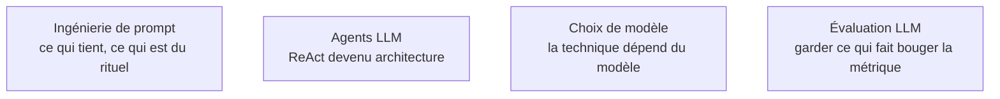

Ces techniques ont été inventées entre 2022 et 2023 pour compenser ce que les modèles ne savaient pas faire seuls ; une bonne moitié a été absorbée par le post-entraînement. Il faut les connaître, et surtout savoir lesquelles sont encore rentables.

## Ce qui a survécu, et à quelle condition

Le **prompt système** porte les invariants — rôle, règles, format, limites — et bénéficie sur la plupart des modèles d'une priorité d'instruction supérieure ; le message utilisateur porte la tâche. Le **role prompting** a un effet réel sur le registre et quasi nul sur l'exactitude : « tu es un expert mondial en X » est du folklore, « réponds comme une note interne pour des juristes non techniques » est une consigne utile. Le **contextual prompting** — fournir les faits plutôt qu'espérer qu'ils soient dans les poids — reste la technique la plus rentable de toute la liste, et c'est l'ancêtre direct du [[parcours/prompt-engineering/context-engineering|context engineering]].

Le **zero-shot** est le défaut raisonnable en 2026. Le **few-shot** reste très efficace pour deux choses seulement : imposer un style ou une convention difficile à décrire, et désambiguïser un cas limite — beaucoup moins pour imposer une structure, désormais affaire de décodage contraint. Attention à l'équilibre des classes dans les exemples : le modèle en imite aussi la distribution.

Côté raisonnement, la ligne de partage est le type de modèle. Le **Chain of Thought** explicite est un gain net sur un modèle instruct classique, redondant voire nuisible sur un modèle à raisonnement. Le **step-back** — faire énoncer le principe général avant de l'appliquer — reste pertinent partout, surtout quand le problème est mal posé. La **self-consistency** fonctionne mais coûte N fois le prix pour un gain que le budget de raisonnement obtient plus proprement. Le **Tree of Thoughts** est trop lourd à régler pour la production ; son idée survit dans l'orchestration d'agents. **ReAct**, enfin, est la seule technique de la liste devenue une **architecture** : on n'écrit plus le format pensée / action / observation à la main, on décrit des outils.

## Ce qu'il faut savoir faire

- **Justifier ce qu'on n'utilise pas** autant que ce qu'on utilise : sur un modèle à raisonnement, ne pas forcer une seconde couche de raisonnement est une décision, pas un oubli.
- **Procéder par soustraction** : partir du prompt minimal, mesurer, n'ajouter qu'un élément à la fois, ne le garder que s'il fait bouger la métrique.
- **Reconnaître le folklore en revue de code** — pourboires imaginaires, majuscules en rafale, « prends une grande respiration », empilement de personas, même consigne répétée à trois endroits. Rien de tout cela ne résiste à une évaluation sérieuse, et certaines pratiques diluent le signal.
- **Employer ce qui est bien vivant** : délimiteurs explicites, exemples négatifs commentés, porte de sortie explicite (« si l'information n'est pas dans le contexte, réponds NON_TROUVE »), critères d'acceptation énoncés dans le prompt.
- **Choisir la technique d'après le modèle cible**, et rejouer ce choix à chaque migration : ce qui était un gain devient parfois une taxe.

> [!warning] Piège
> Empiler les techniques. Un prompt qui cumule persona, chaîne de pensée forcée, self-consistency et schéma strict sur un modèle à raisonnement est plus lent, plus cher et souvent moins bon qu'une instruction nette avec un bon contexte.

## Les notions mobilisées

- [[notions/ingenierie-de-prompt]] — la notion transverse ; cette page en est la lecture historique, technique par technique.
- [[notions/agents-llm]] — l'angle prompt engineering : ReAct industrialisé par le *tool calling*, où le prompt devient un contrat d'exécution.
- [[notions/choix-de-modele]] — instruct ou raisonnement : c'est ce choix qui décide quelle moitié de la liste s'applique.
- [[notions/evaluation-llm]] — la seule façon de trancher entre une technique utile et un rituel coûteux.

## Pour apprendre

- [Prompt Engineering Guide](https://www.promptingguide.ai/) (DAIR.AI) — chaque technique avec le papier d'origine, à parcourir une fois puis à garder en référence.
- [Learn Prompting](https://learnprompting.org/docs/introduction) — le cours structuré, progressif, avec des exercices ; le meilleur point d'entrée pour débuter.
- [Chain-of-Thought Prompting Elicits Reasoning in LLMs](https://arxiv.org/abs/2201.11903) — le papier fondateur, utile pour savoir ce que la technique démontre réellement et sur quelles tailles de modèle.
- [ReAct: Synergizing Reasoning and Acting in Language Models](https://arxiv.org/abs/2210.03629) — l'article qui a fait basculer une technique de prompt en architecture d'agent.
- [Take a Step Back](https://arxiv.org/abs/2310.06117) — la technique la plus sous-utilisée de la liste, et la plus robuste au changement de modèle.
