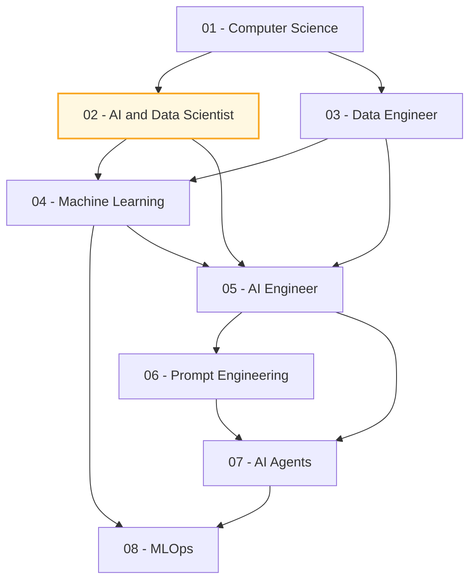

> [!abstract] Huit parcours d'apprentissage roadmap.sh, transposés en notes de référence : chaque note reprend l'intégralité de l'arbre d'origine sous forme de schémas Mermaid, puis l'explique et le complète avec l'état de l'art d'août 2026.

## Comment lire ces notes

Chaque note suit la même structure : une vue macro, puis une étape par grande section de la roadmap d'origine, avec pour chacune un schéma Mermaid, une explication de l'intérêt réel, les points à retenir, un encadré **Ajout 2026** et un encadré **Piège**.

| Signal | Ce que ça veut dire |
|---|---|
| Nœud **en vert pointillé** dans un schéma | Absent de la roadmap d'origine — ajouté d'après l'état 2026 |
| `> [!tip] Ajout 2026` | Ce que la source ne dit pas et qui compte aujourd'hui |
| `> [!warning] Piège` | Erreur classique constatée en vrai sur le sujet |
| Tout le reste | Fidèle au contenu roadmap.sh |

Les schémas se rendent nativement dans Obsidian. Aucun plugin n'est requis.

---

## Le dossier

### Fondations

- [[01 - Roadmap — Computer Science]] — algorithmique, structures de données, systèmes, réseau, bases de données, sécurité. Ce qui ne se périme pas.
- [[02 - Roadmap — AI and Data Scientist]] — le parcours généraliste maths → stats → code → EDA → ML → deep learning → MLOps. **La note pivot** : commencer ici pour situer les autres.

### Données

- [[03 - Roadmap — Data Engineer]] — ingestion, stockage, transformation, orchestration, qualité. La plomberie sans laquelle rien ne tourne.

### Modélisation

- [[04 - Roadmap — Machine Learning]] — le ML classique et la méthodologie : validation, fuite de données, métriques, algorithmes.

### Produits sur LLM

- [[05 - Roadmap — AI Engineer]] — construire sur des modèles pré-entraînés : API, embeddings, RAG, coût, déploiement.
- [[06 - Roadmap — Prompt Engineering]] — ce qui marche encore en 2026, ce qui est devenu du folklore, et le context engineering qui a absorbé le métier.
- [[07 - Roadmap — AI Agents]] — boucle agentique, outils, MCP, mémoire, architectures, évaluation, sécurité.

### Exploitation

- [[08 - Roadmap — MLOps]] — versioning, CI/CD, orchestration, monitoring, drift, coûts, et la part LLMOps.

---

## Carte des dépendances

Les flèches se lisent « aide à comprendre », pas « obligatoire avant ». Seul le tronc `02 → 04 → 08` gagne vraiment à être suivi dans l'ordre.

---

## Trois trajectoires

### Vous venez du développement et visez l'IA appliquée

`05 - AI Engineer` → `06 - Prompt Engineering` → `07 - AI Agents`, puis `03 - Data Engineer` pour les données et `08 - MLOps` pour la mise en production. Le ML classique (`04`) peut attendre : construire sur des modèles pré-entraînés n'en demande presque rien.

### Vous venez de la data science et visez les LLM

`02 - AI and Data Scientist` pour situer l'existant → `05 - AI Engineer` → `07 - AI Agents`. Le choc culturel est réel : on passe d'un monde où l'on entraîne et où l'on mesure une métrique unique à un monde où l'on assemble et où l'on évalue des comportements. La note `06` explique ce basculement.

### Vous voulez consolider les fondations

`01 - Computer Science` puis `03 - Data Engineer`. C'est l'investissement le moins spectaculaire et celui qui se déprécie le moins vite.

---

## Ce qui a le plus bougé depuis la capture des roadmaps

Les roadmaps datent de mars 2026 et les notes sont arrêtées au 3 août 2026. Quatre écarts structurants, développés dans les notes concernées :

1. **Le prompt engineering est devenu du context engineering.** La question n'est plus comment formuler mais quoi mettre dans la fenêtre, dans quel ordre, et quoi en retirer — voir [[06 - Roadmap — Prompt Engineering]].
2. **Les outils se déclarent, ils ne se codent plus.** MCP a standardisé la connexion modèle-outils ; écrire une bonne description d'outil est devenu une compétence en soi — voir [[07 - Roadmap — AI Agents]] et [[11 - MCP et interopérabilité]].
3. **L'évaluation est passée avant la construction.** Sans jeu d'évaluation, il n'y a pas d'ingénierie, seulement des impressions — voir [[08 - Roadmap — MLOps]] et [[14 - Évaluation]].
4. **L'auto-hébergement est redevenu réaliste.** Des modèles utiles tiennent sur une carte grand public — voir [[Modèles locaux sous 24 Go de VRAM]] et [[13 - Serving et infra locale]].

---

## Liens dans le coffre

- [[00 - Index — Etat de l'art RAG 2026]] — le dossier de référence qui approfondit tout ce que les roadmaps `05` et `07` ne font qu'effleurer
- [[00 - Index Data Science & IA]] — le rayon parent
- [[Définitions]] — vocabulaire
- [[Etat de l'art des modèles IA]] — quel modèle pour quoi
- [[Pipeline Data]] — l'application concrète de `03 - Roadmap — Data Engineer`
- [[Liste des projets]] — où mettre tout ça en pratique

---

## Entretien de ce dossier

Les roadmaps roadmap.sh évoluent en continu. Pour rafraîchir : recapturer les pages en HTML complet, réextraire l'arbre, et ne mettre à jour que les sections dont les nœuds ont changé. Les encadrés « Ajout 2026 » sont, eux, à réviser au fil de la veille — ce sont eux qui vieillissent le plus vite.
