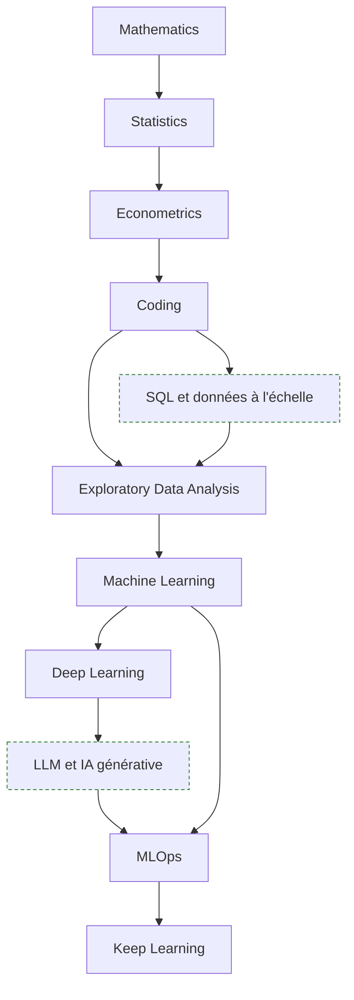
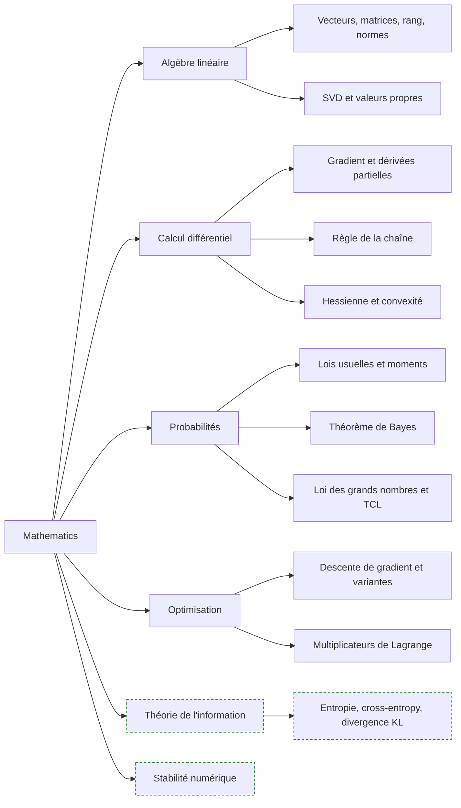
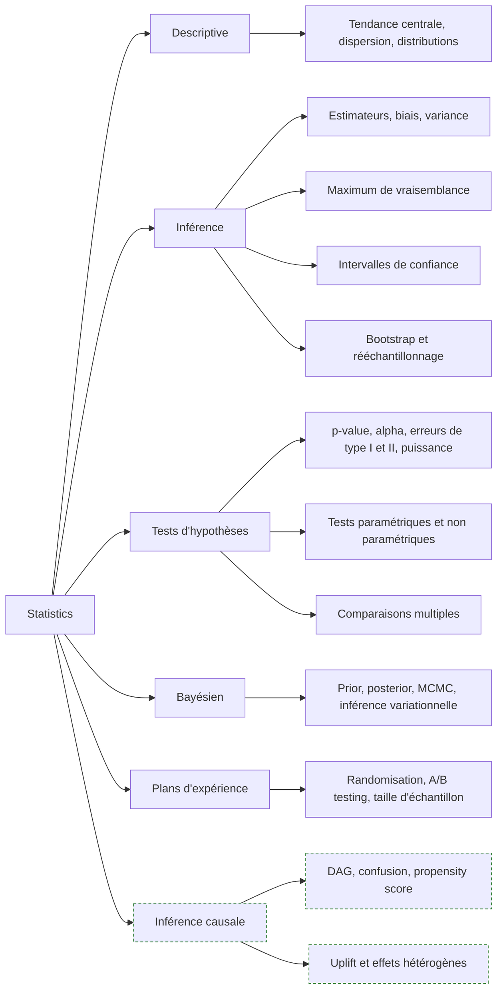
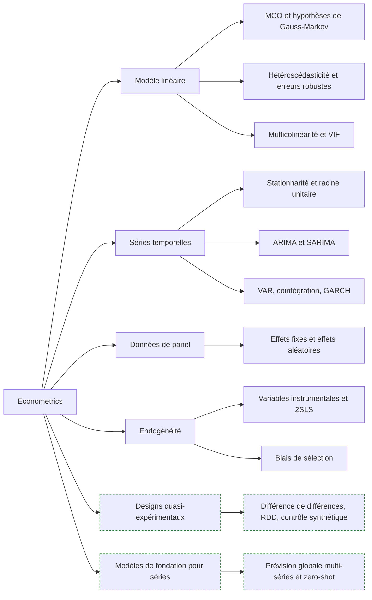
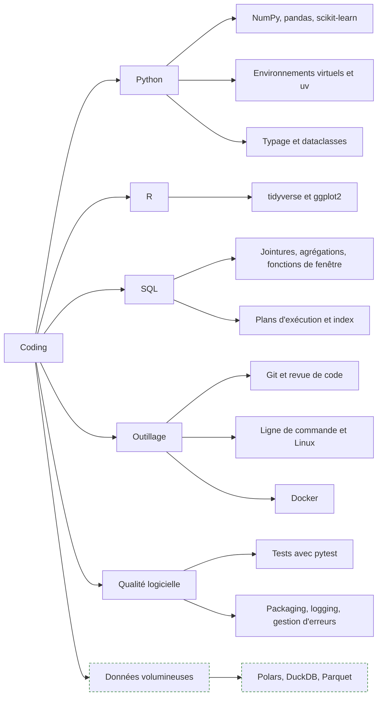
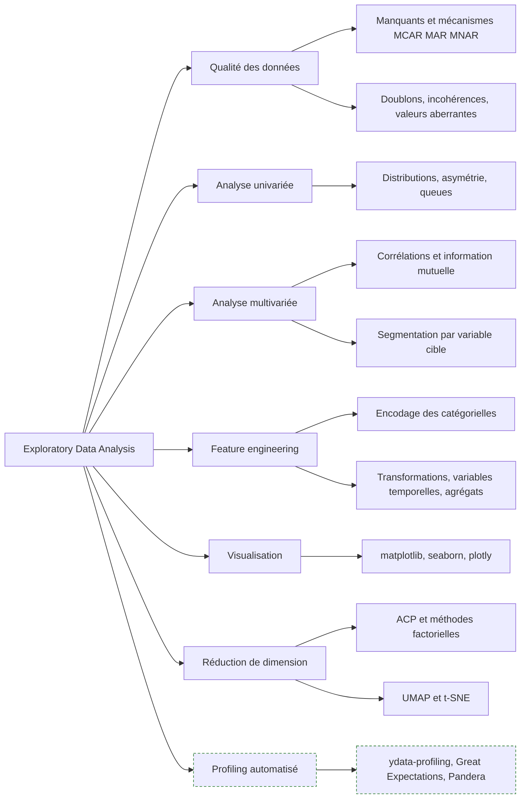

> [!abstract] Le parcours généraliste qui mène des mathématiques à la mise en production de modèles : socle quantitatif, code, analyse exploratoire, machine learning, deep learning, MLOps. C'est la note pivot du dossier Roadmaps — les autres creusent une branche, celle-ci donne la carte.

La roadmap source est volontairement macro : huit étapes, aucun détail. Le contenu des sous-schémas est donc un enrichissement assumé, marqué comme tel dès qu'il change la nature du conseil.

---

## En un coup d'œil

L'ordre est pédagogique, pas chronologique. En pratique on écrit du code dès la première semaine et on revient aux maths quand un modèle refuse de converger. Les trois premières étapes forment un socle qu'on approfondit toute sa carrière, les cinq suivantes constituent un métier.

---

## 1. Mathematics

**À quoi ça sert.** L'algèbre linéaire est le langage dans lequel s'écrivent les données : une table est une matrice, un embedding est un vecteur, une couche de réseau est un produit matriciel. Le calcul différentiel explique pourquoi la backpropagation fonctionne et où elle casse. Les probabilités donnent le vocabulaire de l'incertitude, sans lequel une prédiction n'est qu'un chiffre sans marge. L'optimisation décrit ce que fait réellement un entraînement : minimiser une fonction dans un espace de très grande dimension.

**Ce qu'il faut savoir**

- Produit matriciel et broadcasting — la moitié des bugs NumPy et PyTorch sont des erreurs de forme, pas de logique.
- SVD et décomposition en valeurs propres — fondement de la PCA, du low-rank, et donc de LoRA.
- Gradient, jacobienne, hessienne — savoir lire un gradient qui explose ou s'annule.
- Convexité — comprendre pourquoi la régression logistique a une solution unique et pas un réseau de neurones.
- Entropie et divergence KL — la cross-entropy loss, la distillation et la régularisation des VAE sont des KL déguisées.

> [!tip] Ajout 2026
> Le niveau de maths exigé s'est déplacé, il n'a pas baissé. Écrire un modèle demande moins de maths qu'en 2018 puisque les frameworks font le travail, mais diagnostiquer un entraînement qui diverge, lire un papier sur l'attention linéaire ou comprendre pourquoi une quantification en 4 bits dégrade un modèle et pas un autre en demande davantage. Le triptyque utile aujourd'hui : algèbre linéaire numérique, optimisation stochastique, théorie de l'information.

> [!warning] Piège
> Passer six mois sur des cours de maths avant de toucher un dataset. Le seul mode d'apprentissage qui tient est l'aller-retour concept / implémentation / cas réel. L'erreur symétrique — n'ouvrir aucun livre et empiler des appels de bibliothèques — produit un praticien incapable de dire si un résultat est faux.

---

## 2. Statistics

**À quoi ça sert.** La statistique est ce qui distingue un data scientist d'un utilisateur de scikit-learn. Elle répond à la seule question qui compte devant un décideur : ce que j'observe est-il un signal ou du bruit, et avec quelle marge. C'est aussi la discipline qui fournit le cadre du protocole d'évaluation — validation croisée, intervalle sur une métrique, comparaison de deux modèles.

**Ce qu'il faut savoir**

- Biais-variance — la grille de lecture universelle du sous-apprentissage et du surapprentissage.
- Bootstrap — la façon la plus économique d'obtenir un intervalle sur n'importe quelle métrique, y compris une AUC ou un score de RAG.
- p-value : probabilité des données sous H0, jamais probabilité que H0 soit vraie. La confusion la plus coûteuse du métier.
- Puissance et taille d'échantillon — un test A/B sous-dimensionné ne prouve rien, ni dans un sens ni dans l'autre.
- Correction des comparaisons multiples (Bonferroni, Benjamini-Hochberg) — dès qu'on teste vingt variantes, on trouve un effet à 5 %.

> [!tip] Ajout 2026
> Deux zones absentes de la roadmap ont pris beaucoup d'importance. L'inférence causale appliquée d'abord : les équipes produit ne demandent plus « quel est le churn prédit » mais « qu'est-ce qui le cause et sur qui agir ». L'évaluation statistique des systèmes à base de LLM ensuite : un jeu de test de 50 prompts ne permet aucune conclusion, il faut des intervalles bootstrap sur les scores, des tests appariés entre variantes de prompt, et une gestion explicite de la variance due à la température. Voir [[14 - Évaluation]].

> [!warning] Piège
> Le p-hacking involontaire. On explore, on remarque un segment intéressant, on le teste, on obtient p = 0.03 et on l'écrit dans le rapport. Le test n'était pas préenregistré, l'espace de recherche parcouru était énorme, le résultat ne se reproduira pas. Séparer explicitement phase exploratoire et phase confirmatoire.

---

## 3. Econometrics

**À quoi ça sert.** L'économétrie est la branche de la statistique qui prend au sérieux le fait que les données ne viennent pas d'une expérience contrôlée. Elle apporte deux choses que le machine learning ignore largement : l'interprétation causale d'un coefficient, et le traitement rigoureux de la dépendance temporelle. En entreprise, c'est ce qui permet de répondre à « de combien la promotion a-t-elle augmenté les ventes » plutôt qu'à « combien vais-je vendre demain ».

**Ce qu'il faut savoir**

- Les hypothèses des MCO, et surtout ce qui arrive quand elles tombent : erreurs standard fausses, coefficients biaisés, inférence invalide.
- Stationnarité — une régression entre deux séries non stationnaires produit des corrélations fantômes très convaincantes.
- ARIMA reste la baseline honnête sur une série unique bien comportée, et bat régulièrement des modèles beaucoup plus lourds.
- Effets fixes — la manière la moins chère d'absorber l'hétérogénéité inobservée constante dans le temps.
- Variables instrumentales — puissant et fragile : un instrument faible est pire que pas d'instrument.
- Différence de différences et contrôle synthétique — les outils de fait de l'évaluation d'impact quand on ne peut pas randomiser.

> [!tip] Ajout 2026
> La prévision a basculé vers deux approches absentes de la roadmap. Les modèles globaux entraînés sur des milliers de séries simultanément (gradient boosting sur features de lag, N-BEATS, TFT), qui dominent les compétitions de type M. Et les modèles de fondation pour séries temporelles — Chronos, TimesFM, Moirai, Lag-Llama — utilisables en zero-shot sur une série jamais vue. Ils ne remplacent pas un modèle spécialisé bien réglé, mais donnent en quelques minutes une baseline solide sur un portefeuille de milliers de séries. Détails dans [[Forecasting (Prévision)]].

> [!warning] Piège
> Évaluer une série temporelle par validation croisée aléatoire. Le mélange des indices fait fuiter le futur dans l'entraînement et produit des scores magnifiques et faux. Il faut un découpage temporel strict, idéalement un backtest glissant avec horizon fixe et un gap reproduisant le délai réel entre la donnée et la décision.

---

## 4. Coding

**À quoi ça sert.** Le code est le seul artefact qui survit au projet. Un notebook brillant que personne ne peut relancer six mois plus tard a une valeur nulle. La compétence visée n'est pas « savoir programmer » mais « produire un pipeline reproductible » : versionné, testé, paramétré, exécutable par quelqu'un d'autre sur une autre machine.

**Ce qu'il faut savoir**

- Python est le socle non négociable. R garde un avantage réel en statistique inférentielle, en visualisation exploratoire et en reporting, et reste dominant en recherche académique et en pharma.
- SQL de niveau analytique — CTE, fonctions de fenêtre, agrégations conditionnelles. C'est ce qui est testé en entretien et ce qui sert tous les jours.
- Git avec discipline : branches courtes, commits atomiques, messages lisibles. Voir [[Tutoriel - GIT (Cheat Sheet)]].
- Vectorisation — une boucle Python sur un DataFrame est deux ordres de grandeur plus lente que l'opération vectorisée équivalente.
- Tests au minimum sur les transformations de features et le calcul des métriques, là où un bug reste silencieux.

> [!tip] Ajout 2026
> Trois déplacements depuis 2020. L'outillage Python s'est unifié autour de uv pour les environnements et ruff pour le lint et le format : la pile pip plus venv plus black plus isort plus flake8 est devenue héritée (voir [[Tutoriel -  UV et Python 3.12 sur Windows 11 & WSL]]). pandas n'est plus le choix par défaut unique : Polars en mémoire, DuckDB pour l'analytique SQL sur Parquet, avec un ordre de grandeur de gain sur des tables de plusieurs gigaoctets, sur un simple poste de travail. Enfin l'assistance par LLM au code est standard — le travail utile s'est déplacé vers la spécification, la revue et le test, pas la frappe.

> [!warning] Piège
> Le notebook comme livrable : exécution dans le désordre, état caché, chemins absolus, secrets en clair, aucune fonction réutilisable. Règle de travail — le notebook sert à explorer, tout ce qui doit tourner deux fois migre dans un module Python importé par le notebook.

---

## 5. Exploratory Data Analysis

**À quoi ça sert.** L'EDA est l'étape où l'on découvre que le dataset ne contient pas ce que le cahier des charges affirme : colonnes remplies à 3 %, dates au format américain une année sur deux, variable qui prédit parfaitement la cible parce qu'elle est calculée après. Le temps investi ici est celui qui rapporte le plus — un feature bien construit bat presque toujours un modèle plus sophistiqué.

**Ce qu'il faut savoir**

- Comprendre le mécanisme du manquant avant d'imputer : une absence peut être un signal, auquel cas la bonne réponse est un indicateur de manque, pas une moyenne.
- Distinguer aberration de mesure et queue lourde légitime. Écrêter une distribution de revenus détruit l'information la plus utile.
- Encodage : one-hot pour les cardinalités faibles, target encoding avec validation croisée interne pour les fortes, ordinal seulement si l'ordre existe.
- Visualiser avant de résumer : le quartet d'Anscombe et le datasaurus rappellent que des distributions très différentes partagent moyenne, variance et corrélation.
- ACP et méthodes factorielles pour la structure, UMAP pour visualiser des embeddings. Voir [[Méthodes Factorielles (Analyses Exploratoires)]].

> [!tip] Ajout 2026
> Le profiling automatisé fait gratuitement les deux premières heures d'EDA : ydata-profiling ou les résumés natifs de Polars pour la photographie initiale, Great Expectations ou Pandera pour transformer les constats en contrats de données vérifiés à chaque exécution du pipeline. L'apport réel n'est pas le gain de temps, c'est que les hypothèses implicites deviennent des tests qui échouent bruyamment quand la source change.

> [!warning] Piège
> La fuite de données par feature : colonne dérivée de la cible, agrégation calculée sur l'ensemble du dataset avant le découpage, identifiant encodant l'ordre chronologique. Symptôme typique, une AUC de 0.99 en validation qui s'effondre en production. Toute statistique servant à transformer les features doit être ajustée sur le train seulement, à l'intérieur du pipeline.

---

## 6. Machine Learning

```mermaid
flowchart TD
    root["Machine Learning"] --> sup["Supervisé"]
    root --> unsup["Non supervisé"]
    root --> meth["Méthodologie"]
    root --> interp["Interprétabilité"]
    root --> aml["AutoML et modèles tabulaires pré-entraînés"]:::ajout
    sup --> sup1["Régression linéaire et régularisée"]
    sup --> sup2["Régression logistique"]
    sup --> sup3["Arbres, Random Forest, bagging"]
    sup --> sup4["Gradient boosting XGBoost LightGBM CatBoost"]
    sup --> sup5["SVM, k plus proches voisins, Naive Bayes"]
    unsup --> unsup1["k-means et clustering hiérarchique"]
    unsup --> unsup2["DBSCAN et modèles de mélange"]
    unsup --> unsup3["Détection d'anomalies et règles d'association"]
    meth --> meth1["Découpage train validation test et validation croisée"]
    meth --> meth3["Métriques par type de problème"]
    meth --> meth4["Recherche d'hyperparamètres"]
    meth --> meth5["Déséquilibre de classes"]
    meth --> meth6["Calibration des probabilités"]:::ajout
    interp --> interp1["Permutation, SHAP, dépendances partielles"]
    classDef ajout stroke:#2e7d32,stroke-width:1px,stroke-dasharray:4 3
```

**À quoi ça sert.** C'est le cœur opérationnel du métier. Sur données tabulaires — la très grande majorité des problèmes en entreprise — le machine learning classique reste l'outil de référence et le gradient boosting la baseline à battre. La difficulté n'est pas l'algorithme, disponible en trois lignes, mais le protocole : construire un jeu de validation représentatif, choisir une métrique alignée sur la décision métier, résister à la tentation d'optimiser sur le test.

**Ce qu'il faut savoir**

- Choisir la métrique avant le modèle : l'accuracy sur classes déséquilibrées ne veut rien dire, la PR-AUC est plus informative que la ROC-AUC quand les positifs sont rares, RMSE et MAE n'ont pas la même sensibilité aux extrêmes.
- Un modèle mal calibré donne des scores inutilisables comme probabilités : Platt scaling ou isotonic regression dès que le score sert à un seuil métier ou à un calcul d'espérance.
- Le déséquilibre se traite d'abord par la métrique et le seuil, ensuite par les poids de classes, en dernier recours par le rééchantillonnage. SMOTE est surutilisé et dégrade souvent la calibration.
- Hyperparamètres : recherche bayésienne (Optuna) plutôt que grille exhaustive, avec un budget fixé à l'avance.
- SHAP pour l'explication locale et globale, en gardant en tête que ce sont des attributions de contribution, pas des effets causaux.
- Clustering et typologies : voir [[Classification Automatique (Clustering)]] pour le choix de méthode et la validation du nombre de groupes.

> [!tip] Ajout 2026
> Deux évolutions sur le tabulaire. Les modèles pré-entraînés de type TabPFN atteignent des performances comparables à un gradient boosting réglé sur des jeux de taille petite à moyenne, sans entraînement — excellente baseline instantanée. Et les LLM se sont révélés mauvais pour la prédiction tabulaire mais très bons pour l'ingénierie de features à partir de texte libre. L'architecture pertinente pour beaucoup de problèmes est donc hybride : un LLM extrait des attributs structurés depuis du texte, un gradient boosting prédit à partir de ces attributs.

> [!warning] Piège
> Optimiser les hyperparamètres sur le jeu de test. Après vingt itérations, le score de test n'est plus une estimation de généralisation mais un score d'entraînement déguisé. Trois jeux séparés, ou une validation croisée imbriquée, et le test ouvert une seule fois.

---

## 7. Deep Learning

```mermaid
flowchart TD
    root["Deep Learning"] --> base["Fondamentaux"]
    root --> arch["Architectures"]
    root --> train["Entraînement"]
    root --> fw["Frameworks"]
    root --> gen["IA générative"]:::ajout
    base --> base1["Perceptron et couches denses"]
    base --> base2["Activations et fonctions de coût"]
    base --> base3["Backpropagation et graphe de calcul"]
    arch --> arch1["CNN, RNN, LSTM, GRU"]
    arch --> arch3["Transformers et attention"]
    arch --> arch4["Autoencodeurs, VAE, GAN"]
    train --> train1["Optimiseurs SGD, Adam, AdamW"]
    train --> train2["Dropout, early stopping, normalisation batch et layer"]
    train --> train4["Transfer learning et fine-tuning"]
    train --> train5["Précision mixte et gestion GPU"]
    fw --> fw1["PyTorch, Keras, TensorFlow"]
    gen --> gen1["LLM et pré-entraînement"]:::ajout
    gen --> gen2["LoRA, QLoRA, PEFT"]:::ajout
    gen --> gen3["Diffusion et multimodal"]:::ajout
    gen --> gen4["State space models et Mamba"]:::ajout
    classDef ajout stroke:#2e7d32,stroke-width:1px,stroke-dasharray:4 3
```

**À quoi ça sert.** Le deep learning est l'outil des données non structurées : texte, image, son, signal, séquences. Sur du tabulaire il apporte rarement un gain suffisant pour justifier son coût. La compétence critique n'est pas d'empiler des couches mais de diagnostiquer un entraînement : lire des courbes de loss, distinguer un problème de données d'un problème d'optimisation, savoir quand un modèle plus petit et mieux régularisé bat un modèle plus gros.

**Ce qu'il faut savoir**

- Le mécanisme d'attention, en détail. C'est le seul concept qui explique à la fois les LLM, les modèles de vision récents et une grande partie de la recherche actuelle. Voir [[Le Transformer en passe d'être dépassé]] pour les alternatives émergentes.
- Transfer learning : partir d'un modèle pré-entraîné est la norme absolue. Entraîner depuis zéro n'a de sens que sur un domaine sans équivalent public.
- Fine-tuning paramétriquement efficace — LoRA et QLoRA permettent d'adapter un modèle de plusieurs milliards de paramètres sur un seul GPU grand public.
- Diagnostiquer : loss qui stagne (learning rate, initialisation, données), écart train/validation qui explose (surapprentissage, fuite), loss qui devient NaN (instabilité numérique, gradient explosif).
- Précision numérique : bfloat16 à l'entraînement, quantification 8 ou 4 bits à l'inférence, avec un coût en qualité qu'il faut mesurer et non supposer.
- PyTorch est le standard de fait en recherche et de plus en plus en production ; connaître Keras reste utile pour lire du code existant.

> [!tip] Ajout 2026
> Pour un data scientist généraliste, la question n'est presque jamais « dois-je entraîner un modèle » mais « dois-je appeler une API, servir un modèle ouvert, ou fine-tuner ». Ordre de préférence par coût croissant : prompting, RAG sur données propriétaires, fine-tuning LoRA, entraînement complet. Le fine-tuning impose un format, un ton ou un domaine étroit — il n'injecte pas de connaissances factuelles, c'est le rôle du RAG. Sur le service local voir [[Modèles locaux sous 24 Go de VRAM]] et [[13 - Serving et infra locale]] ; sur les architectures alternatives à l'attention quadratique, [[Etat de l'art des modèles IA]].

> [!warning] Piège
> Sortir l'artillerie deep learning sur 5 000 lignes tabulaires. Un LightGBM entraîné en quinze secondes fera mieux, sera interprétable et se déploiera sans GPU. Le deep learning devient pertinent quand la donnée est non structurée, ou quand le volume dépasse largement ce qu'un modèle à features explicites peut exploiter.

---

## 8. MLOps

```mermaid
flowchart TD
    root["MLOps"] --> ver["Versionnement"]
    root --> exp["Suivi d'expériences"]
    root --> orch["Orchestration"]
    root --> serve["Mise en service"]
    root --> mon["Supervision"]
    root --> gov["Gouvernance"]:::ajout
    root --> lops["LLMOps"]:::ajout
    ver --> ver1["Code, données, modèles, registre"]
    exp --> exp1["MLflow, Weights and Biases, seeds"]
    orch --> orch1["Airflow, Dagster, Prefect"]
    orch --> orch2["Feature store"]
    serve --> serve1["API, conteneurs, Kubernetes"]
    serve --> serve2["Batch contre temps réel"]
    serve --> serve3["CI CD et tests de modèle"]
    mon --> mon1["Dérive des données et du concept"]
    mon --> mon2["Métriques métier, alertes, réentraînement"]
    gov --> gov1["Traçabilité, audit, AI Act"]:::ajout
    lops --> lops1["Évaluations automatisées"]:::ajout
    lops --> lops2["Observabilité des traces"]:::ajout
    lops --> lops3["Garde-fous et coût par requête"]:::ajout
    classDef ajout stroke:#2e7d32,stroke-width:1px,stroke-dasharray:4 3
```

**À quoi ça sert.** Un modèle non déployé n'a produit aucune valeur, et un modèle déployé sans supervision produit de la valeur négative dès que la distribution change. Le MLOps transforme un résultat de notebook en système qui tourne, se surveille et se remplace sans drame. Pour un data scientist, l'objectif n'est pas de devenir ingénieur plateforme mais de livrer quelque chose qu'une équipe d'exploitation peut accepter.

**Ce qu'il faut savoir**

- Versionner ensemble code, données et modèle — sans les trois, un résultat n'est pas reproductible et un incident n'est pas diagnosticable.
- Tracer chaque expérience automatiquement : hyperparamètres, métriques, artefacts, empreinte du jeu de données. MLflow suffit dans la plupart des cas.
- Séparer entraînement et inférence, y compris dans le code de transformation des features, sous peine de training-serving skew.
- Surveiller trois dérives distinctes : features en entrée, distribution de la cible, métrique métier. Elles n'arrivent pas en même temps et la première est un signal précoce.
- Prévoir le retour arrière avant la mise en production : déploiement progressif, shadow mode, comparaison A/B contre le modèle en place.
- Voir [[Pipeline Data]] pour l'amont et [[Servir modèle à grande échelle]] pour l'aval.

> [!tip] Ajout 2026
> Le MLOps classique ne couvre pas les systèmes à base de LLM, qui représentent aujourd'hui une bonne moitié du travail. Il faut y ajouter une suite d'évaluations versionnée exécutée à chaque changement de prompt ou de modèle ([[14 - Évaluation]]), une observabilité par traces capturant toute la chaîne prompt, retrieval, appels d'outils, réponse ([[15 - Observabilité et traçabilité]]), un suivi du coût et de la latence par requête, et des garde-fous en entrée et en sortie contre la prompt injection et les fuites de données ([[16 - Sécurité et gouvernance]]). Côté réglementaire, les obligations de l'AI Act européen pour les systèmes à haut risque — documentation technique, gestion des risques, supervision humaine, journalisation — sont entrées en application par étapes et concernent directement la documentation de modèle.

> [!warning] Piège
> Le réentraînement automatique sans porte de qualité. Le modèle se réentraîne chaque nuit sur des données fraîches, une source amont casse, le modèle apprend du bruit et se déploie seul. Tout réentraînement doit franchir un seuil de performance sur un jeu de référence figé, et échouer bruyamment plutôt que déployer silencieusement.

---

## 9. Keep Learning

Le nœud final de la roadmap n'est pas décoratif : la moitié de la boîte à outils de 2020 est obsolète, l'autre moitié — maths, statistique, protocole d'évaluation — n'a pas bougé d'un pouce. Savoir distinguer les deux est la compétence la plus rentable du métier.

- **Durée de vie longue** : algèbre linéaire, probabilités, inférence causale, conception d'expériences, rigueur du protocole, capacité à traduire un problème métier en question mesurable.
- **Durée de vie courte** : noms de bibliothèques, classements de modèles, frameworks d'agents, prix d'API. À suivre sans s'y attacher.
- **Un rythme qui tient** : un projet de bout en bout par trimestre, de la donnée brute au service supervisé — le seul format qui révèle les trous. Une lecture de papier par semaine, en privilégiant les travaux d'évaluation et de reproduction aux annonces de modèles.

---

## Parcours conseillé

| Ordre | Étape | Effort | À viser |
|---|---|---|---|
| 1 | Coding (Python, SQL, Git) | ~4 semaines | Un pipeline reproductible versionné, lançable par un tiers |
| 2 | Mathematics | ~4 semaines | Lire un gradient et une décomposition matricielle sans blocage |
| 3 | Statistics | ~6 semaines | Concevoir un A/B test correct, produire un intervalle bootstrap |
| 4 | Exploratory Data Analysis | ~3 semaines | Détecter fuite, dérive et manquants avant de modéliser |
| 5 | Machine Learning | ~8 semaines | Battre une baseline sur un problème tabulaire, protocole propre |
| 6 | Econometrics | ~4 semaines | Backtest temporel correct, lecture causale d'un coefficient |
| 7 | Deep Learning | ~8 semaines | Fine-tuner un modèle pré-entraîné, diagnostiquer un entraînement |
| 8 | MLOps | ~6 semaines | Un modèle servi, tracé, supervisé, avec retour arrière |
| 9 | Spécialisation | continu | Choisir une branche : AI Engineer, ML, Data Engineer, MLOps |

Douze à dix-huit mois avant d'être opérationnel en travaillant à côté, spécialisation non comprise. Les étapes 1 et 4 sont les plus sous-estimées et celles qui distinguent le plus les profils en entretien.

---

## Liens dans le coffre

- [[Arbre de Décision Méthodologique]] — choisir la famille de méthode selon le type de question et de données, en amont de tout ce parcours.
- [[Inférence Statistique et Tests d'Hypothèses]] — approfondissement direct de l'étape 2.
- [[Forecasting (Prévision)]] — approfondissement de la partie séries temporelles de l'étape 3.
- [[Classification Automatique (Clustering)]] — le non supervisé de l'étape 6 en détail.
- [[Pipeline Data]] — l'amont industriel de l'étape 8.
- [[00 - Index — Etat de l'art RAG 2026]] — porte d'entrée du volet IA générative, complémentaire des étapes 7 et 8.

**Roadmaps voisines**

- [[parcours/computer-science/index|Parcours Computer Science]] — les fondations informatiques sous l'étape Coding.
- [[03 - Roadmap — Data Engineer]] — l'amont : ingestion, stockage, transformation à l'échelle.
- [[04 - Roadmap — Machine Learning]] — l'étape 6 en profondeur.
- [[05 - Roadmap — AI Engineer]] — la bifurcation applicative : construire des produits sur des modèles existants.
- [[parcours/prompt-engineering/index|Parcours Prompt Engineering]] et [[07 - Roadmap — AI Agents]] — le prolongement génératif et agentique.
- [[08 - Roadmap — MLOps]] — l'étape 8 en profondeur.

## Pour aller plus loin

- *Mathematics for Machine Learning* — Deisenroth, Faisal, Ong. Le seul livre de maths calibré exactement sur les besoins du domaine.
- *An Introduction to Statistical Learning* puis *The Elements of Statistical Learning* — James, Witten, Hastie, Tibshirani. Dans cet ordre, jamais l'inverse.
- *Statistical Rethinking* — Richard McElreath. La meilleure entrée en statistique bayésienne, cours vidéo inclus.
- *Causal Inference: The Mixtape* — Cunningham, et *Mostly Harmless Econometrics* — Angrist et Pischke, pour l'inférence causale appliquée.
- *Forecasting: Principles and Practice* — Hyndman et Athanasopoulos. Référence libre sur les séries temporelles.
- *Hands-On Machine Learning with Scikit-Learn, Keras and TensorFlow* — Aurélien Géron. Le pont le plus efficace entre théorie et code.
- *Deep Learning* — Goodfellow, Bengio, Courville, et *Dive into Deep Learning* — Zhang et al. pour la version avec code exécutable.
- *Designing Machine Learning Systems* et *AI Engineering* — Chip Huyen. Respectivement pour l'étape 8 et pour la bifurcation IA générative.
- Documentations officielles à lire comme des cours : scikit-learn (guide utilisateur), PyTorch (tutoriels), MLflow, Optuna.
