> [!abstract] Le parcours complet de la plomberie data — générer, stocker, ingérer, transformer, orchestrer et servir la donnée — pour qui veut construire les fondations sur lesquelles reposent l'analytics, le ML et les systèmes RAG.

## En un coup d'œil

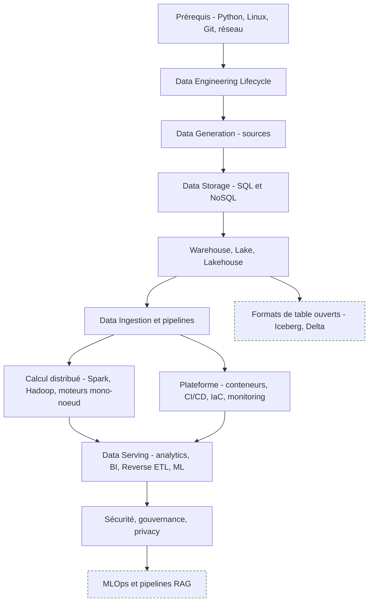

---

## 1. Introduction, prérequis et cycle de vie

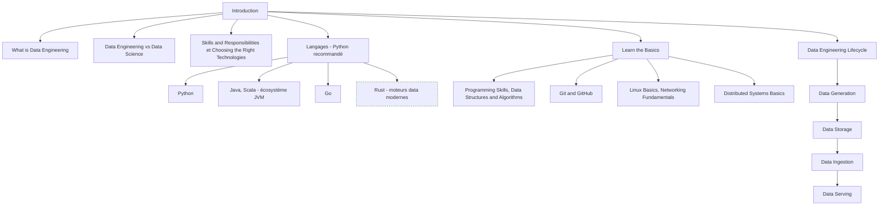

**À quoi ça sert.** Le data engineer construit et exploite les systèmes qui rendent la donnée utilisable par d'autres : analystes, data scientists, applications. La frontière avec le data scientist est simple à énoncer — l'un garantit que la donnée arrive, propre, fraîche et au bon format, l'autre en tire un modèle ou une décision — mais elle bouge selon la taille de l'équipe, et c'est souvent le data engineer qui hérite du dernier kilomètre de fiabilité. Le cycle de vie génération, stockage, ingestion, serving est le fil rouge de toute la roadmap : chaque outil appris ensuite occupe une case de ce schéma.

**Ce qu'il faut savoir**

- Python — le standard de fait pour l'orchestration, la transformation légère et le glue code. C'est le langage à maîtriser en premier ; Java et Scala restent le socle JVM de Spark, Kafka, Flink et Hadoop, et Go sert aux outils d'infra à forte concurrence.
- Programmation — tests, packaging, typage, logs structurés. Un pipeline est du code de production, pas un notebook promu par accident. Les structures de données servent surtout à raisonner sur jointures, tris externes et coût mémoire d'un shuffle.
- Git, Linux et réseau — branches, revue de code et tags de release ; permissions, systemd, processus, pipes ; TCP, DNS, HTTP, TLS, proxies, subnets. La moitié des incidents de production se règlent là.
- Systèmes distribués — partitionnement, réplication, consensus, tolérance aux pannes, idempotence : un pipeline est par nature un système partiellement défaillant.
- Choix technologique — arbitrer sur le volume réel, la latence exigée, le coût d'exploitation et les compétences de l'équipe, pas sur la hype.

> [!tip] Ajout 2026
> Rust s'est imposé dans les moteurs data sans qu'on ait à l'écrire : Polars, DataFusion, delta-rs. Conséquence pratique — des traitements de quelques dizaines de Go qui exigeaient un cluster Spark tiennent sur une seule machine. Côté outillage Python, `uv` (environnements et lockfile reproductible) et `ruff` ont remplacé la pile pip plus flake8 plus black.

> [!warning] Piège
> Se déclarer data engineer en sachant écrire un DAG Airflow mais pas lire un plan d'exécution SQL. Le goulot d'étranglement est presque toujours dans la base ou dans le format de stockage, pas dans l'orchestrateur. Corollaire — un job qui a réussi une fois n'est pas correct pour autant : sans idempotence, la première relance après incident duplique les lignes.

---

## 2. Data Generation — d'où vient la donnée

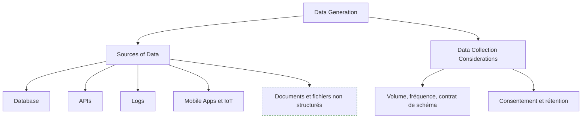

**À quoi ça sert.** Le point d'entrée détermine tout le reste. Une base transactionnelle se lit en CDC ou par extraction incrémentale, une API impose ses quotas et sa pagination, des logs arrivent en flux continu et non ordonné, l'IoT ajoute des horloges désynchronisées et des pertes de paquets. Se poser les bonnes questions à ce stade — qui produit, à quelle fréquence, avec quelle garantie de schéma, qui a le droit de consommer — évite de repayer trois fois plus loin dans la chaîne.

**Ce qu'il faut savoir**

- Database et APIs — extraction batch sur clé incrémentale ou CDC via le journal de transactions (Debezium) pour ne pas charger la source ; côté API, pagination, rate limiting, backoff exponentiel, idempotency keys, et stockage brut de la réponse avant tout parsing.
- Logs — volumétrie élevée, format instable, ordre non garanti : horodatez à l'émission et à la réception.
- Mobile Apps et IoT — événements bufferisés côté client ou connectivité intermittente, donc arrivées tardives de plusieurs heures et horloges désynchronisées. Prévoyez des fenêtres de retraitement.
- Considérations de collecte — volume, fréquence, consentement, rétention, et surtout contrat de schéma explicite avec le producteur : sinon chaque déploiement amont casse le pipeline en silence.

> [!tip] Ajout 2026
> Une source absente de la roadmap 2026 pèse aujourd'hui lourd : les documents non structurés (PDF, mails, tickets, pages web) ingérés pour alimenter des systèmes RAG. Le pipeline est le même en esprit — extraction, normalisation, versionnement, idempotence — mais la charge se déplace vers le parsing et la préservation de la structure. Voir [[03 - Ingestion documentaire]].

> [!warning] Piège
> Transformer avant de stocker le brut. Dès qu'une règle métier change, ou qu'un bug de parsing est découvert, sans copie brute immuable il faut re-solliciter la source — quand elle existe encore. Stockez le payload d'origine, en append-only, daté.

---

## 3. Data Storage — bases de données

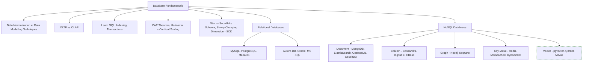

**À quoi ça sert.** Le choix du store engage la modélisation, les performances et le coût pour des années. La ligne de partage la plus utile n'est pas SQL contre NoSQL mais OLTP contre OLAP : écritures nombreuses et petites, en ligne, contre lectures analytiques massives en colonnes. Un entrepôt attaqué comme une base transactionnelle, ou l'inverse, produit des factures absurdes. Le modèle dimensionnel — faits, dimensions, étoile ou flocon — reste la manière la plus lisible d'organiser un entrepôt.

**Ce qu'il faut savoir**

- Normalisation et modélisation — 3NF côté OLTP contre dénormalisation assumée côté OLAP ; Kimball (étoile) pour l'analytique consommée par des humains, Data Vault quand l'historisation et l'auditabilité priment. Le flocon normalise les dimensions et économise du stockage au prix de requêtes plus lourdes : rarement le bon arbitrage aujourd'hui.
- SQL — window functions, CTE, `GROUP BY` avec `HAVING`, jointures anti et semi, plans d'exécution. C'est la compétence la plus durable de la liste.
- Indexation et transactions — B-tree, hash, GIN pour le JSON et le texte, index partiels (un index de trop pénalise les écritures) ; ACID, niveaux d'isolation, deadlocks. Pour l'historisation, SCD de type 1 (écrasement) ou de type 2 (nouvelle ligne avec période de validité, seule façon de rejouer un rapport tel qu'il était l'an dernier).
- CAP et scaling — en cas de partition réseau, arbitrer cohérence contre disponibilité (c'est la clé de lecture de Cassandra ou DynamoDB) ; monter en vertical d'abord, en horizontal ensuite via sharding ou réplicas de lecture.

> [!tip] Ajout 2026
> La famille « vector » manque à la source. Concrètement : pgvector suffit jusqu'à quelques millions de vecteurs et évite d'ajouter un système à opérer ; au-delà, ou avec un besoin de filtrage hybride sophistiqué, un store dédié (Qdrant, Milvus, Weaviate) se justifie. Detail à retenir — les index ANN sont approximatifs, donc le rappel devient un paramètre de configuration, pas une garantie. Voir [[05 - Stores et index]].

> [!warning] Piège
> Choisir MongoDB « parce que le schéma va évoluer ». Le schéma existe toujours, il migre simplement dans le code applicatif où personne ne le documente. Postgres avec des colonnes JSONB couvre la majorité de ces cas tout en gardant les transactions et les jointures.

---

## 4. Data Warehousing, Lake et architectures

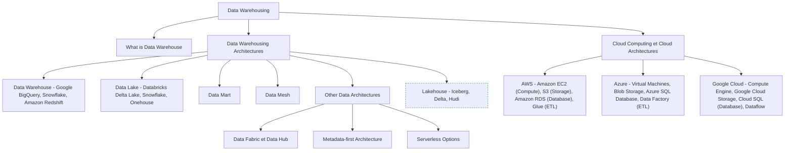

**À quoi ça sert.** L'entrepôt est un store analytique où la donnée est modélisée et de qualité contrôlée ; le lac est un espace de stockage brut, peu cher, à schéma tardif. Les deux ont convergé : les entrepôts lisent désormais des fichiers sur object storage, les lacs ont gagné des transactions. Le data mart est une découpe de l'entrepôt par domaine métier ; le data mesh déplace la responsabilité de la donnée vers les équipes qui la produisent, avec des contrats et des SLO — c'est une organisation autant qu'une architecture.

**Ce qu'il faut savoir**

- Entrepôt et lac — BigQuery (serverless, facturation à l'octet scanné), Snowflake (séparation stockage/calcul), Redshift (clusters) côté entrepôt ; Delta Lake sur Databricks et Onehouse côté lac, avec S3, GCS ou Blob Storage comme socle.
- Data mart et data mesh — le premier est une découpe métier restreinte de l'entrepôt ; le second répartit domaines propriétaires, data as a product et gouvernance fédérée, et n'a de sens qu'avec une vraie maturité d'équipe.
- Data fabric, data hub, metadata-first, serverless — variantes centrées sur le catalogue et la couche sémantique plutôt que sur le déplacement physique ; le serverless supprime le cluster à opérer mais rend la facture imprévisible sans surveillance des requêtes.
- Cloud — les trois fournisseurs proposent le même quatuor (calcul, object storage, base managée, service ETL) : apprendre l'un des trois transfère bien vers les autres.

> [!tip] Ajout 2026
> Le lakehouse s'est standardisé autour d'Apache Iceberg, aujourd'hui lisible et parfois inscriptible par Snowflake, BigQuery, Databricks, DuckDB et Trino. L'intérêt réel est la sortie du verrou fournisseur : les données restent en Parquet dans votre bucket, plusieurs moteurs les attaquent, le catalogue devient le point de contrôle. Si vous démarrez une plateforme en 2026, posez la question Iceberg avant de choisir un moteur.

> [!warning] Piège
> Le data lake qui devient un marécage. Sans catalogue, sans partitionnement cohérent et sans propriétaire nommé par jeu de données, un bucket S3 se remplit de fichiers que plus personne n'ose supprimer. Imposez dès le premier jour un chemin conventionnel, un format colonne et un enregistrement au catalogue.

---

## 5. Data Ingestion, ETL et orchestration

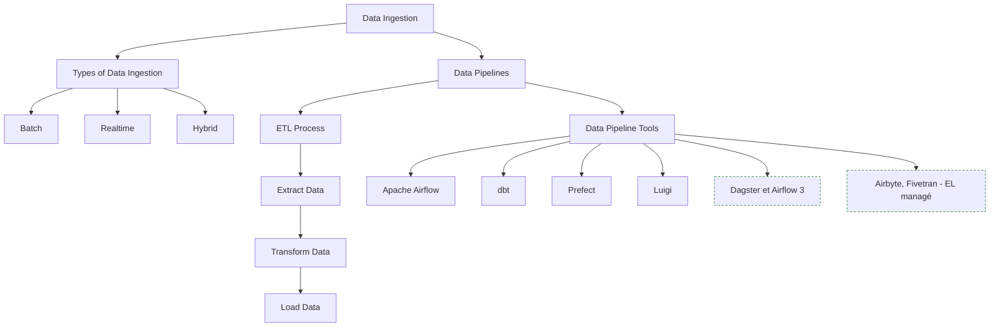

**À quoi ça sert.** L'ingestion est le cœur du métier : déplacer la donnée de manière fiable, reproductible et observable. Le batch traite des fenêtres closes et se rejoue facilement ; le temps réel traite des événements au fil de l'eau et impose de gérer l'arrivée tardive et l'ordre. L'hybride — micro-batch — couvre la majorité des besoins réels, où « temps réel » signifie en fait quelques minutes. Le passage de ETL à ELT est le changement structurant : on charge d'abord brut dans l'entrepôt, on transforme ensuite en SQL versionné.

**Ce qu'il faut savoir**

- Batch contre realtime — le batch est simple, testable et rejouable, à privilégier tant que la latence exigée dépasse la minute ; le temps réel (Kafka plus un moteur de stream) coûte nettement plus cher à opérer et se justifie quand la fraîcheur a une valeur métier chiffrable.
- Extract, Transform, Load — dans l'ordre ELT quand l'entrepôt a la puissance de calcul, ce qui est la norme aujourd'hui. Airflow reste l'orchestrateur de référence (DAG en Python, écosystème d'operators fourni), sa version 3 ayant modernisé le scheduling et l'exécution distante des tâches.
- dbt — transformations SQL versionnées, tests, documentation et lineage générés. C'est le T de ELT, pas un orchestrateur. Prefect et Luigi sont les alternatives Python à Airflow, la seconde étant historique et peu active.
- Backfill — capacité à rejouer une plage de dates : concevez les DAG paramétrés par date d'exécution dès le départ.

> [!tip] Ajout 2026
> Deux évolutions à connaître. Dagster a gagné du terrain avec son modèle centré sur les assets — on déclare les tables produites plutôt que les tâches, ce qui rend le lineage et la re-matérialisation naturels. Et les connecteurs EL managés (Airbyte, Fivetran) ont rendu absurde le fait d'écrire soi-même un connecteur Salesforce ou Stripe : gardez votre code pour les sources spécifiques à votre métier. Côté IA, l'orchestration d'agents pose exactement les mêmes problèmes de reprise, de dépendances et d'observabilité, sous un autre vocabulaire.

> [!warning] Piège
> Mettre la logique métier dans les tâches d'orchestration. L'orchestrateur planifie, réessaie et alerte ; il ne transforme pas. Un DAG Airflow contenant 400 lignes de pandas est intestable et irrejouable hors d'Airflow. Sortez le traitement dans un module ou une requête SQL appelée par la tâche.

---

## 6. Calcul distribué et big data

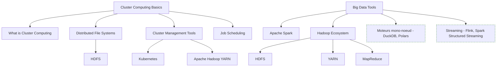

**À quoi ça sert.** Quand un jeu de données ne tient plus en mémoire sur une machine, il faut le partitionner et distribuer le calcul. Spark est l'outil dominant : API DataFrame en Python, Scala ou SQL, exécution planifiée sur un cluster, tolérance aux pannes par re-calcul des partitions perdues. Hadoop reste utile à comprendre comme socle conceptuel — stockage distribué HDFS, ordonnancement YARN, modèle MapReduce — même si peu de plateformes neuves le déploient encore.

**Ce qu'il faut savoir**

- Cluster computing et stockage distribué — plusieurs machines vues comme une ressource unique, dont le vrai coût est le réseau entre elles ; HDFS historiquement, object storage (S3, GCS) en pratique, avec une sémantique différente (pas de renommage atomique, cohérence à surveiller).
- Gestion de cluster et ordonnancement — YARN dans le monde Hadoop, Kubernetes partout ailleurs y compris pour Spark ; files, priorités, quotas et préemption, faute de quoi le premier job mal écrit monopolise le cluster.
- Spark — comprendre le shuffle, le partitionnement, le broadcast join et le lazy evaluation : c'est là que se joue l'essentiel des performances. MapReduce, son ancêtre, reste utile pour raisonner et obsolète pour écrire.

> [!tip] Ajout 2026
> Avant de sortir Spark, mesurez. DuckDB traite couramment plusieurs dizaines de Go de Parquet sur un simple laptop, en SQL, sans cluster. Polars couvre le même terrain côté DataFrame avec une exécution lazy. La règle empirique que j'applique : sous 100 Go et sans besoin de parallélisme multi-machines, le mono-noeud gagne en coût, en latence et en simplicité de debug. Spark redevient pertinent au-delà, ou quand le calcul doit s'exécuter au plus près de données déjà distribuées.

> [!warning] Piège
> Le shuffle involontaire. Une jointure sur une clé non partitionnée, ou un `groupBy` à forte cardinalité, redistribue tout le jeu de données sur le réseau et fait exploser les temps. Regardez le plan physique, cherchez les `Exchange`, et envisagez le broadcast quand une des tables est petite.

---

## 7. Plateforme — conteneurs, CI/CD, monitoring, tests, IaC

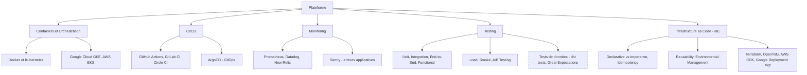

**À quoi ça sert.** C'est la partie du métier qui ressemble au DevOps, et elle n'est pas optionnelle : un pipeline non déployable automatiquement, non surveillé et non testé finit maintenu à la main par la seule personne qui le connaît. Docker fige l'environnement d'exécution, Kubernetes le fait tourner, la CI/CD garantit que ce qui passe en production est ce qui a été revu, l'IaC rend l'infrastructure reproductible et jetable, le monitoring dit ce qui casse avant que l'utilisateur ne le signale.

**Ce qu'il faut savoir**

- Docker et Kubernetes — images minces, multi-stage build, pas de secret dans l'image, tag immuable plutôt que `latest` ; côté cluster, pods, jobs et cronjobs, requests et limits. GKE et EKS sont les versions managées, opérer soi-même un cluster est rarement rentable.
- CI/CD et monitoring — lint, tests, build d'image, déploiement, avec ArgoCD pour le modèle GitOps où l'état du cluster suit un dépôt Git ; Prometheus pour les métriques, Sentry pour les erreurs applicatives, Datadog et New Relic pour l'offre intégrée.
- Tests — unitaires sur les transformations, intégration contre une base éphémère, smoke après déploiement, charge sur les endpoints de serving ; l'A/B relève du produit mais le data engineer en fournit la mesure.
- IaC — déclaratif (on décrit l'état cible) plutôt qu'impératif ; idempotence, modules réutilisables, séparation stricte des environnements par workspace ou par état distinct. Terraform et OpenTofu partagent le même langage, OpenTofu étant le fork open source né du changement de licence.

> [!tip] Ajout 2026
> Le test qui manque presque partout n'est pas le test de code mais le test de données : fraîcheur, unicité de clé, non-nullité, plages de valeurs, volumétrie attendue. `dbt test`, Great Expectations ou Soda posent ces assertions dans le pipeline, et un échec bloque la publication plutôt que de propager des chiffres faux. Sur les métriques et la traçabilité, la logique est la même que côté IA, voir [[15 - Observabilité et traçabilité]].

> [!warning] Piège
> Alerter sur le succès technique des tâches uniquement. Un DAG vert qui charge zéro ligne pendant trois jours est un incident majeur invisible. Surveillez les métriques métier — nombre de lignes, fraîcheur maximale, écart au jour précédent — pas seulement le code de sortie.

---

## 8. Messaging systems

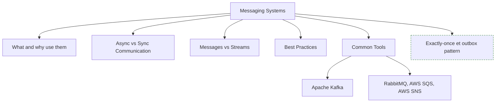

**À quoi ça sert.** Un bus de messages découple producteurs et consommateurs : le producteur n'attend pas, le consommateur absorbe à son rythme, et une panne temporaire d'un côté ne propage pas au reste. La distinction messages contre streams est structurante — une file (RabbitMQ, SQS) distribue un message à un consommateur puis l'oublie ; un log distribué (Kafka) conserve les événements et permet à plusieurs consommateurs indépendants de rejouer l'historique depuis l'offset de leur choix.

**Ce qu'il faut savoir**

- Synchrone contre asynchrone — l'asynchrone achète la résilience au prix de la cohérence immédiate et du confort de debug.
- Kafka — topics, partitions, groupes de consommateurs, rétention. La partition est l'unité d'ordre et de parallélisme : l'ordre n'est garanti qu'à l'intérieur d'une partition.
- RabbitMQ, SQS et SNS — routage riche par exchanges et routing keys chez RabbitMQ, file et publication/abonnement managés chez AWS. Adaptés au travail par tâches, pas au flux analytique rejouable.
- Bonnes pratiques — clé de partition réfléchie, schéma versionné (Avro ou Protobuf via un schema registry), dead letter queue, consommateurs idempotents.

> [!tip] Ajout 2026
> L'exactly-once reste largement un mythe de bout en bout. Ce qu'on obtient en pratique : at-least-once côté transport plus idempotence côté consommateur, ce qui produit un résultat équivalent. Le pattern outbox — écrire l'événement dans la même transaction que la mutation métier, puis le publier par CDC — reste la façon la plus fiable d'éviter les divergences entre base et bus.

> [!warning] Piège
> Utiliser Kafka comme base de données. La rétention finit par expirer, les requêtes ponctuelles sont impossibles, et personne ne sait quel est l'état courant. Kafka transporte et rejoue ; l'état vit dans un store.

---

## 9. Data Serving — analytics, BI et reverse ETL

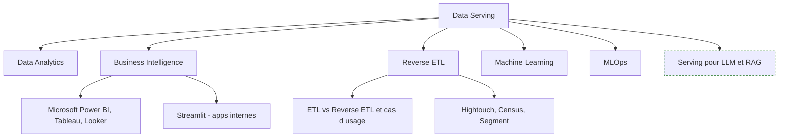

**À quoi ça sert.** C'est le moment où la donnée produit de la valeur : tableaux de bord, exploration ad hoc, modèles entraînés, et retour vers les outils opérationnels. Le reverse ETL renverse la flèche habituelle — l'entrepôt redevient source et pousse des segments enrichis vers le CRM, l'outil de support ou la plateforme d'emailing. Machine learning et MLOps sont la continuité naturelle du pipeline : un modèle n'est qu'un consommateur exigeant de features fraîches et versionnées.

**Ce qu'il faut savoir**

- Data analytics et BI — le data engineer fournit des tables propres et documentées, pas des extractions à la demande ; Power BI et Tableau côté entreprise, Looker avec sa couche sémantique LookML, Streamlit pour les applications internes en Python.
- Couche sémantique — définir « chiffre d'affaires » une seule fois plutôt que dans chaque rapport, meilleur remède aux réunions où deux équipes affichent deux chiffres différents.
- Reverse ETL — Hightouch, Census, Segment, pour du scoring de leads, des segments marketing, de l'enrichissement de fiches client. Même mécanique que l'ETL en sens inverse, avec des contraintes plus dures côté destination : quotas d'API SaaS, idempotence, effets métier immédiats en cas d'erreur.
- ML et MLOps — feature engineering reproductible, versionnement des jeux de données, entraînement et déploiement automatisés. Voir [[08 - Roadmap — MLOps]].

> [!tip] Ajout 2026
> Le data engineer est devenu un acteur central des systèmes RAG et des agents : c'est lui qui construit l'ingestion documentaire, maintient les index, gère la fraîcheur et le versionnement des corpus. Deux ponts concrets avec le coffre — [[08 - Données structurées et Text-to-SQL]] pour l'accès en langage naturel à l'entrepôt (le modèle sémantique et la documentation des colonnes font plus pour la qualité que le choix du LLM), et l'hébergement des modèles d'embedding, qui devient une brique d'infra comme une autre.

> [!warning] Piège
> Le tableau de bord sans propriétaire. Les outils BI accumulent des centaines de rapports dont on ignore lesquels sont consultés, ce qui rend impossible toute évolution du modèle. Instrumentez l'usage et supprimez sans état d'âme.

---

## 10. Sécurité, gouvernance et privacy

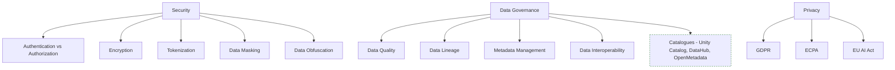

**À quoi ça sert.** Ces sujets arrivent en fin de roadmap et devraient arriver au début de vos projets : rattraper une gouvernance absente coûte dix fois plus cher que de la poser d'emblée. L'authentification identifie, l'autorisation décide de ce qui est permis ; le chiffrement protège au repos et en transit ; tokenisation, masquage et obfuscation permettent de travailler sur des données sensibles sans les exposer. La gouvernance ajoute la question du sens : qui produit cette table, d'où viennent ses colonnes, à quel point est-elle fiable.

**Ce qu'il faut savoir**

- AuthN contre AuthZ et chiffrement — SSO et OIDC pour l'identité, RBAC ou ABAC pour les droits, row-level et column-level security dans l'entrepôt ; TLS en transit, chiffrement au repos avec clés gérées (KMS) et rotation planifiée.
- Tokenisation, masquage, obfuscation — le jeton est réversible via un coffre, le masquage ne l'est pas et sert aux environnements hors production.
- Data quality et lineage — complétude, unicité, fraîcheur, cohérence référentielle, plages de valeurs, mesurées en continu ; et savoir quelles tables sont impactées avant de changer une colonne, ce que dbt et les catalogues génèrent automatiquement.
- Metadata management et interopérabilité — catalogue, glossaire métier, formats et protocoles standards, pour que les systèmes se parlent sans adaptateur ad hoc.
- RGPD et ECPA — base légale, minimisation, durées de rétention, droit à l'effacement (savoir supprimer une personne dans un lac immuable exige d'y avoir pensé avant) ; l'ECPA encadre côté américain l'interception des communications électroniques, ce qui touche les logs de messagerie et de trafic.
- EU AI Act — obligations graduées par niveau de risque, entrée en application échelonnée. Le data engineer est concerné par la traçabilité des jeux de données d'entraînement et la documentation technique.

> [!tip] Ajout 2026
> Le catalogue est devenu le vrai point de contrôle de la plateforme : Unity Catalog côté Databricks, DataHub et OpenMetadata en open source, Polaris et consorts pour Iceberg. Ils regroupent découverte, lineage, droits et qualité au même endroit — ce que la roadmap éclate en quatre sous-sujets distincts. Sur le versant IA, voir [[16 - Sécurité et gouvernance]].

> [!warning] Piège
> Copier la production vers un environnement de développement « juste pour tester ». C'est la fuite de données la plus banale et la plus fréquente. Générez des jeux synthétiques ou masqués, et rendez la copie brute techniquement impossible plutôt qu'interdite par note de service.

---

## Parcours conseillé

| Ordre | Étape | Effort | À viser |
|---|---|---|---|
| 1 | Python, Linux, Git, réseau | ~3 semaines | Écrire un script d'extraction packagé, testé et versionné |
| 2 | SQL et fondamentaux de bases de données | ~4 semaines | Window functions, index, plans d'exécution, modèle en étoile |
| 3 | Modélisation et entrepôt | ~3 semaines | Charger une source dans un entrepôt et modéliser trois faits |
| 4 | Ingestion et orchestration (Airflow, dbt) | ~4 semaines | Un pipeline ELT quotidien, testé, rejouable par backfill |
| 5 | Cloud et stockage objet | ~3 semaines | Un bucket, un entrepôt, des droits, une facture surveillée |
| 6 | Docker, CI/CD, IaC | ~3 semaines | Déploiement automatisé du pipeline, infra en Terraform |
| 7 | Streaming et messaging (Kafka) | ~3 semaines | Un producteur, un consommateur idempotent, une DLQ |
| 8 | Spark ou moteurs mono-noeud | ~3 semaines | Savoir décider entre DuckDB et un cluster, et le justifier |
| 9 | Qualité, gouvernance, sécurité | ~4 semaines | Tests de données bloquants, catalogue à jour, droits fins et effacement RGPD |

---

## Liens dans le coffre

- [[Pipeline Data]] — la vue pratique du même sujet, à lire en parallèle de cette roadmap
- [[03 - Ingestion documentaire]] — l'ingestion appliquée aux documents non structurés pour le RAG, mêmes exigences d'idempotence et de versionnement
- [[05 - Stores et index]] — la famille de stores que la roadmap ne couvre pas : vectoriel, hybride, index ANN
- [[08 - Données structurées et Text-to-SQL]] — comment un LLM attaque l'entrepôt que vous construisez, et pourquoi le modèle sémantique compte
- [[15 - Observabilité et traçabilité]] — métriques, traces et alertes, transposables des pipelines aux chaînes LLM
- [[16 - Sécurité et gouvernance]] — le pendant IA des sections sécurité, gouvernance et privacy

Autres roadmaps liées :

- [[parcours/data-scientist/index|Data Scientist]] — le consommateur principal de vos pipelines
- [[08 - Roadmap — MLOps]] — la suite naturelle : industrialiser modèles et features, en amont de [[05 - Roadmap — AI Engineer]] quand la donnée alimente des systèmes LLM

## Pour aller plus loin

- Joe Reis et Matt Housley, *Fundamentals of Data Engineering* — la référence sur le cycle de vie, exactement le plan de cette roadmap
- Martin Kleppmann, *Designing Data-Intensive Applications* — le livre à lire pour comprendre réplication, partitionnement et consensus
- Ralph Kimball et Margy Ross, *The Data Warehouse Toolkit* — modélisation dimensionnelle, toujours d'actualité
- Documentations officielles dbt, Airflow, Apache Iceberg, et la section « Performance Tuning » de Spark — meilleures que la plupart des tutoriels
- Andy Pavlo, cours « Intro to Database Systems » et « Advanced Database Systems » (Carnegie Mellon), disponibles publiquement — pour les internals des moteurs
