> [!abstract] Le parcours complet du ML classique et fondamental : maths, Python, données, familles d'algorithmes, évaluation rigoureuse et deep learning — pour qui veut construire des modèles qui tiennent en production, pas seulement suivre l'engouement du moment.

## En un coup d'œil

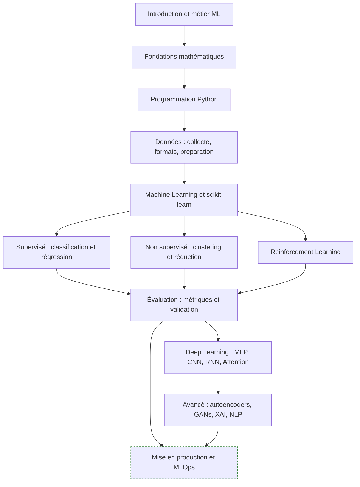

Le fil rouge n'est pas la liste d'algorithmes : c'est la boucle données → modèle → mesure. Qui maîtrise la partie « mesure » rattrape vite les algorithmes qui lui manquent ; l'inverse n'est pas vrai.

---

## 1. Introduction : le métier et les pré-requis

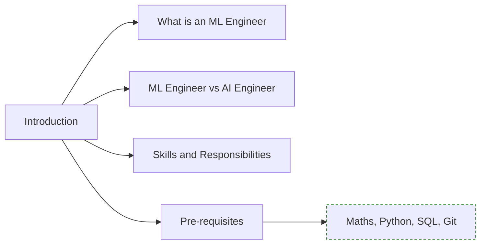

**À quoi ça sert.** La distinction ML Engineer / AI Engineer structure tout le reste du parcours. Le ML Engineer part de données brutes, construit un jeu d'entraînement, entraîne et valide un modèle qu'il possède de bout en bout. L'AI Engineer part d'un modèle pré-entraîné qu'il ne réentraîne généralement pas et compose autour de lui : prompts, retrieval, outils, garde-fous. Les deux métiers partagent l'exigence d'évaluation mais pas la boîte à outils.

**Ce qu'il faut savoir**

- **What is an ML Engineer / ML Engineer vs AI Engineer** — profil hybride : statistiques appliquées, génie logiciel, compréhension du domaine, la modélisation ne représentant en pratique qu'une fraction minoritaire du temps. L'un optimise une fonction de perte sur ses données, l'autre un système autour d'un modèle qu'il consomme via API ou en local.
- **Skills and Responsibilities / Pre-requisites** — cadrer un problème métier en tâche apprenable, définir cible et métrique avant d'écrire une ligne de code, livrer un modèle mesurable et reproductible. Socle exigé : algèbre linéaire, analyse, probabilités, Python, SQL. Rien d'exotique, mais il faut les avoir vraiment.

> [!tip] Ajout 2026
> Le marché a séparé les deux rôles beaucoup plus nettement qu'en 2023. Voir [[parcours/ai-engineer/index|AI Engineer]] pour la branche LLM et agents. La compétence qui distingue aujourd'hui un profil senior d'un profil junior n'est pas la connaissance des architectures récentes mais la capacité à dire « ce problème ne se traite pas par apprentissage » et à proposer une règle métier ou une optimisation classique à la place.

> [!warning] Piège
> Sauter les fondamentaux ML parce qu'on travaille sur des LLM. La quasi-totalité des erreurs d'évaluation observées sur des systèmes RAG ou agentiques sont des erreurs de ML classique : jeu de test contaminé, métrique moyennée sur des strates hétérogènes, absence de baseline.

---

## 2. Fondations mathématiques

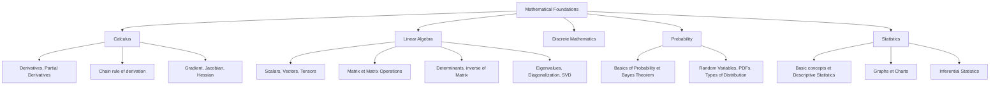

**À quoi ça sert.** Ces quatre blocs ne servent pas à réimplémenter les algorithmes : ils servent à comprendre pourquoi un modèle échoue. La chain rule explique la backpropagation et les gradients qui explosent ou s'évanouissent. La SVD et la diagonalisation expliquent la PCA, la colinéarité et le conditionnement d'un problème de régression. Le théorème de Bayes explique le déséquilibre de classes bien mieux que n'importe quel tutoriel. Les statistiques inférentielles expliquent pourquoi un écart de 0,3 point d'accuracy entre deux modèles ne veut rien dire.

**Ce qu'il faut savoir**

- **Calculus** — *Derivatives, Partial Derivatives*, *Chain rule of derivation*, *Gradient, Jacobian, Hessian*. La dérivée partielle donne la sensibilité de la perte à un paramètre, la chain rule la propage à travers les couches empilées : c'est tout le mécanisme de la backpropagation. Le gradient donne la direction de descente, la Hessienne la courbure — de quoi comprendre plateaux, taux d'apprentissage et raison d'être d'Adam.
- **Linear Algebra, socle** — *Scalars, Vectors, Tensors*, *Matrix et Matrix Operations*. Vocabulaire de NumPy et PyTorch : savoir lire une forme de tenseur et anticiper un broadcast évite l'essentiel des bugs de shape.
- **Linear Algebra, outils** — *Determinants, inverse of Matrix*, *Eigenvalues, Diagonalization*, *Singular Value Decomposition*. Déterminant proche de zéro = matrice mal conditionnée = coefficients de régression instables, signal direct de colinéarité. Valeurs propres et SVD sont le socle de la PCA, des méthodes factorielles et des approximations de rang faible (dont LoRA est un cousin direct).
- **Discrete Mathematics** — combinatoire, graphes, logique : sous-jacent aux arbres de décision, aux algorithmes de graphes et à la complexité.
- **Probability** — *Basics of Probability*, *Bayes Theorem*, *Random Variables, PDFs*, *Types of Distribution*. La probabilité conditionnelle est le langage naturel de la classification ; Bayes explique pourquoi un test à 99 % de sensibilité produit une majorité de faux positifs sur un événement rare. Reconnaître la loi d'une variable (normale, binomiale, Poisson, log-normale) oriente la transformation et la fonction de perte.
- **Statistics** — *Basic concepts*, *Descriptive Statistics*, *Graphs et Charts*, *Inferential Statistics*. Moyenne, variance, quantiles et corrélation pour décrire ; le graphique comme outil de diagnostic, pas de communication ; tests, intervalles de confiance et bootstrap pour transformer « mon modèle est meilleur » en affirmation défendable.

> [!tip] Ajout 2026
> Le bootstrap sur le jeu de test est devenu le réflexe minimal pour rapporter un résultat : rééchantillonner le test 1000 fois et donner un intervalle plutôt qu'un point. C'est cinq lignes de code et cela désamorce la moitié des discussions stériles sur des écarts non significatifs entre modèles.

> [!warning] Piège
> Croire qu'il faut « finir les maths » avant de commencer le ML. La bonne boucle est inverse : coder un modèle, buter sur un comportement inexpliqué, revenir sur la notion mathématique concernée. Le pré-requis strictement bloquant se limite à l'algèbre linéaire de base et à la notion de dérivée.

---

## 3. Python, outillage et préparation des données

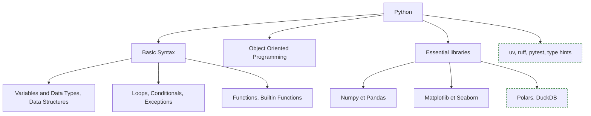

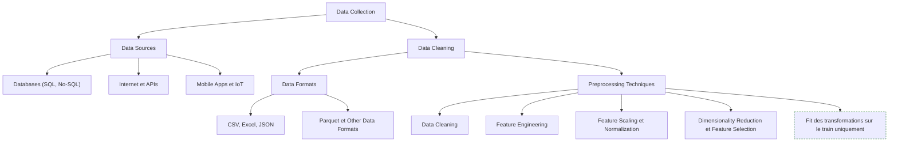

**À quoi ça sert.** Python est le seul langage réellement nécessaire pour la modélisation, mais l'écrire en data scientist et l'écrire en ingénieur sont deux compétences distinctes : le passage du notebook au module testé décide si un modèle atteint la production. La partie données, elle, consomme le plus de temps et détermine le plus fortement la performance finale — et le préprocessing est l'endroit précis où se produisent la majorité des fuites.

**Ce qu'il faut savoir**

- **Basic Syntax, Exceptions, Functions** — *Variables and Data Types*, *Data Structures*, *Loops*, *Conditionals*, *Exceptions*, *Functions, Builtin Functions*. Connaître la complexité des listes, dicts et sets : une jointure faite en boucle sur une liste au lieu d'un dict transforme quelques secondes en quelques heures. Un pipeline doit échouer bruyamment sur une donnée aberrante, pas produire des NaN silencieux ; fonctions pures et sans état global, condition de la reproductibilité.
- **Object Oriented Programming** — indispensable pour implémenter l'interface `fit` / `transform` et brancher son propre code dans un `Pipeline`.
- **Numpy / Pandas** — broadcasting et vectorisation d'un côté ; chargement, jointures, `groupby`, séries temporelles de l'autre. Surveiller les types : une colonne `object` qui devrait être numérique est la source classique de résultats faux.
- **Matplotlib / Seaborn** — Matplotlib pour le contrôle fin, Seaborn pour l'exploration rapide. Un scatter plot révèle des ruptures qu'aucun coefficient de corrélation ne montre.
- **Data Sources** — *Databases (SQL, No-SQL)* est la source la plus fréquente en entreprise : une requête avec fenêtrage évite de rapatrier des millions de lignes. *Internet* et *APIs* imposent pagination, rate limiting et versionnage de schéma. *Mobile Apps* et *IoT* apportent des flux événementiels dont le décalage d'horloge entre appareils est une source classique de fuite temporelle.
- **Data Formats** — *CSV* et *Excel* sont universels et sans typage fiable : formats d'échange, jamais de stockage. *JSON* pour les API, à aplatir tôt et à valider. *Parquet* — colonne, compressé, typé — est le défaut pour tout jeu intermédiaire ou final ; parmi les *Other Data Formats*, Avro et ORC côté ingestion, Arrow comme format mémoire d'échange.
- **Data Cleaning / Feature Engineering / Feature Scaling et Normalization** — valeurs manquantes, doublons, outliers, incohérences d'unités, chaque décision documentée car une imputation non tracée est une hypothèse cachée. Le feature engineering (agrégations temporelles, ratios, encodages, variables de calendrier) reste la source de gain la plus rentable en ML tabulaire. La mise à l'échelle est obligatoire pour KNN, SVM, régression régularisée et réseaux de neurones, et sans effet sur les modèles à base d'arbres.
- **Dimensionality Reduction / Feature Selection** — PCA pour réduire bruit et coût au prix de l'interprétabilité ; sélection par filtre (corrélation, information mutuelle), wrapper (élimination récursive) ou embedded (Lasso, importance des arbres). À faire **à l'intérieur** de la validation croisée.

> [!tip] Ajout 2026
> Au-delà de quelques Go, Polars et DuckDB remplacent avantageusement Pandas : multi-thread, évaluation paresseuse, empreinte mémoire bien moindre, et DuckDB requête des Parquet en SQL sans les charger. Côté outillage, `uv` et `ruff` sont devenus le standard de fait — voir [[Tutoriel -  UV et Python 3.12 sur Windows 11 & WSL]]. Sur les features, les feature stores restent surdimensionnés pour la plupart des projets, mais leur idée centrale a gagné : le point-in-time join, ne joindre que les valeurs disponibles à l'instant de la prédiction, seule protection sérieuse contre la fuite temporelle sur données transactionnelles. Voir [[Pipeline Data]].

> [!warning] Piège
> Faire le `fit` du scaler, de l'imputer ou du sélecteur sur le jeu complet avant le split. Le modèle voit alors la moyenne et la variance du test, l'évaluation devient optimiste et rien ne le signale. Solution systématique : tout le préprocessing dans un `Pipeline` scikit-learn, et le `Pipeline` entier passé à la validation croisée. Corollaire Pandas : ne jamais ignorer un `SettingWithCopyWarning`, il annonce des features partiellement remplies bien plus tard.

---

## 4. Machine learning : cadre général et scikit-learn

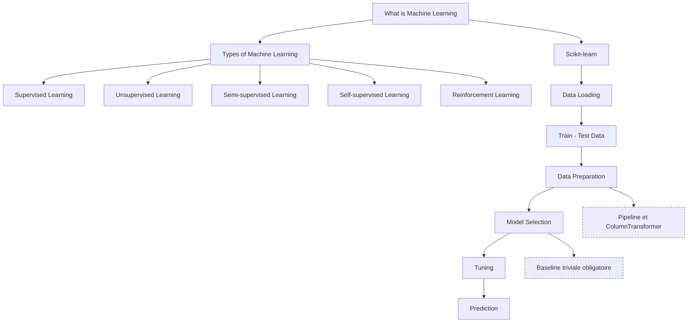

**À quoi ça sert.** La typologie des apprentissages sert à cadrer un problème avant de choisir un algorithme. La question n'est pas « quel modèle », mais « ai-je des labels, en quelle quantité, et à quel coût puis-je en obtenir plus ». Scikit-learn fournit l'API qui rend tout le reste interchangeable : le même code de validation fonctionne avec une régression logistique ou un gradient boosting.

**Ce qu'il faut savoir**

- **What is Machine Learning** — apprendre une fonction à partir d'exemples plutôt que de l'écrire. Le corollaire : le modèle ne peut pas être meilleur que le signal contenu dans les données.
- **Types of Machine Learning** — *Supervised* (labels disponibles, cas le plus fréquent et le mieux outillé), *Unsupervised* (structure sans labels, évaluation intrinsèquement difficile), *Semi-supervised* (peu de labels, beaucoup de brut : pseudo-labellisation, régularisation par cohérence), *Reinforcement* (interaction et récompense différée).
- **Self-supervised Learning** — la supervision est fabriquée depuis la donnée elle-même : masquage, prédiction du token suivant, contraste. C'est le paradigme qui a rendu possible les modèles de fondation, et il mérite une place à part dans cette liste.
- **Data Loading / Train - Test Data / Data Preparation / Model Selection** — le split est la première décision méthodologique : stratifié en classification déséquilibrée, chronologique en séries temporelles, par groupe si plusieurs lignes viennent d'une même entité. Ensuite seulement, encodage, imputation et mise à l'échelle encapsulés dans un `Pipeline`, puis comparaison de plusieurs familles sur la même validation et la même métrique.
- **Tuning / Prediction** — `GridSearchCV` pour peu d'hyperparamètres, recherche aléatoire ou bayésienne au-delà, toujours sur un jeu de validation distinct du test final. À la sortie, ne pas confondre `predict` et `predict_proba` : le seuil de 0,5 est un choix par défaut, rarement le bon.

> [!tip] Ajout 2026
> Le passage à l'échelle du self-supervised a produit des modèles de fondation tabulaires (famille TabPFN et successeurs) qui font de la classification sur petits jeux de données sans entraînement, par inférence in-context. Sur quelques milliers de lignes, ils rivalisent avec un gradient boosting réglé. Cela ne remplace pas la méthodologie, mais cela change le point de départ d'un prototype.

> [!warning] Piège
> Absence de baseline. Avant tout modèle, mesurer la performance de la règle triviale : classe majoritaire, moyenne, ou valeur de la veille en série temporelle. Un modèle qui ne bat pas cette baseline de façon significative n'est pas un modèle, et il arrive plus souvent qu'on ne l'admet.

---

## 5. Apprentissage supervisé

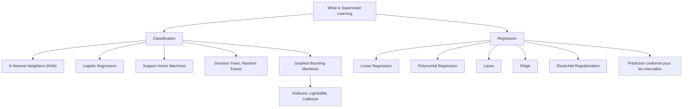

**À quoi ça sert.** C'est le cœur productif du ML : la grande majorité des modèles réellement déployés en entreprise sont ici, sur données tabulaires. Le compromis biais-variance se lit directement dans cette liste, du modèle linéaire fortement contraint à l'ensemble d'arbres très flexible. La régularisation n'est pas un détail de réglage : c'est le mécanisme central qui contrôle ce compromis.

**Ce qu'il faut savoir**

- **What is Supervised Learning** — apprendre une application entrée → cible à partir de paires étiquetées, avec l'hypothèse forte que train et production suivent la même distribution.
- **K-Nearest Neighbors (KNN) / Logistic Regression** — le KNN n'a pas d'entraînement, tout son coût est à l'inférence, il exige une mise à l'échelle et s'effondre en grande dimension. La régression logistique reste la baseline de classification par excellence : rapide, interprétable, probabilités bien calibrées par construction.
- **Support Vector Machines** — marge maximale et kernel trick pour les frontières non linéaires. Excellent en petite dimension d'échantillon, coûteux au-delà de quelques dizaines de milliers de lignes.
- **Decision Trees, Random Forest** — l'arbre seul surapprend ; la forêt agrège des arbres décorrélés par bagging et échantillonnage de variables. Robuste, peu de réglages.
- **Gradient Boosting Machines** — construction séquentielle où chaque arbre corrige le résidu du précédent. Reste l'état de l'art sur données tabulaires, devant les réseaux de neurones dans la plupart des benchmarks.
- **Linear Regression / Polynomial Regression** — moindres carrés et hypothèses sur les résidus, à lire autant comme outil d'analyse que comme prédicteur ; l'expansion polynomiale ajoute la non-linéarité mais explose en nombre de termes et surapprend vite.
- **Ridge / Lasso / ElasticNet Regularization** — L2 réduit la variance et gère la colinéarité en conservant toutes les variables ; L1 met des coefficients exactement à zéro et fait donc de la sélection ; ElasticNet combine les deux, préférable quand des variables corrélées doivent être conservées en groupe.

> [!tip] Ajout 2026
> La roadmap dit « Gradient Boosting Machines » sans nommer les implémentations : en pratique, LightGBM pour la vitesse sur gros volumes, CatBoost pour les variables catégorielles à forte cardinalité (encodage ordonné intégré, moins de fuite qu'un target encoding fait main), XGBoost par défaut ailleurs. Autre ajout qui a pris de l'importance : la prédiction conforme (conformal prediction) produit des intervalles avec garantie de couverture, sans hypothèse sur le modèle. C'est aujourd'hui la façon la plus simple de livrer une incertitude défendable.

> [!warning] Piège
> Optimiser les hyperparamètres du boosting jusqu'à la troisième décimale pendant que la fonction de coût métier reste ignorée. Un faux négatif et un faux positif ont rarement le même prix ; ajuster le seuil de décision sur ce coût rapporte presque toujours davantage que cent itérations de tuning.

---

## 6. Apprentissage non supervisé et par renforcement

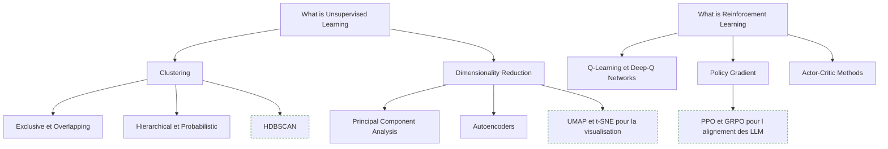

**À quoi ça sert.** Ces deux familles partagent un problème : l'absence de cible étiquetée, donc de métrique arbitre évidente. Le non supervisé sert à explorer, segmenter, réduire le bruit et détecter des anomalies, et ses résultats doivent être validés par un critère externe — stabilité sous rééchantillonnage, ou utilité en aval sur une tâche supervisée. Le RL, lui, traite la décision séquentielle où l'action modifie l'état futur et où la récompense arrive avec retard : peu déployé en entreprise hors robotique, jeux et contrôle, mais devenu incontournable indirectement puisque c'est le mécanisme d'alignement et d'entraînement au raisonnement des LLM actuels.

**Ce qu'il faut savoir**

- **What is Unsupervised Learning** — découvrir une structure sans cible. Le nombre de clusters, la métrique de distance et la mise à l'échelle sont des hypothèses fortes, pas des paramètres neutres.
- **Exclusive / Overlapping** — un seul cluster par point (k-means, k-medoids), qui suppose des groupes convexes de taille comparable ; ou appartenance partielle (fuzzy c-means) quand les frontières sont réellement floues.
- **Hierarchical / Probabilistic** — le dendrogramme agglomératif évite de fixer le nombre de clusters et se lit visuellement ; les mélanges gaussiens donnent une probabilité d'appartenance et acceptent des clusters ellipsoïdaux de tailles différentes.
- **Principal Component Analysis / Autoencoders** — projection linéaire maximisant la variance via valeurs propres ou SVD, sur données centrées-réduites ; ou réduction non linéaire par réseau encodeur-décodeur, utile en détection d'anomalies via l'erreur de reconstruction.
- **What is Reinforcement Learning** — agent, environnement, état, action, récompense. Le compromis exploration/exploitation est le problème central.
- **Q-Learning / Deep-Q Networks** — apprentissage hors politique de la valeur des paires état-action, dans une table limitée aux espaces discrets et petits ; remplacer la table par un réseau, avec replay buffer et réseau cible pour stabiliser, a rendu l'approche applicable à des entrées visuelles.
- **Policy Gradient / Actor-Critic Methods** — optimisation directe de la politique par montée de gradient sur la récompense espérée : gère les actions continues, au prix d'une variance de gradient élevée. L'acteur-critique ajoute un estimateur de valeur qui réduit cette variance ; A2C, TRPO et PPO en dérivent.

> [!tip] Ajout 2026
> HDBSCAN a largement remplacé k-means en exploration réelle : pas de nombre de clusters à fixer, formes arbitraires, et une classe « bruit » explicite pour les points non assignables — ce que k-means ne sait pas faire puisqu'il force chaque point dans un groupe. UMAP sert à visualiser, uniquement à visualiser : clusteriser sur une projection UMAP fabrique des groupes qui n'existent pas. Côté RL, PPO reste la référence pour le RLHF, mais l'entraînement au raisonnement des modèles récents s'appuie surtout sur des variantes sans réseau de valeur, type GRPO, où l'avantage est estimé par comparaison entre plusieurs réponses échantillonnées pour le même prompt : plus léger en mémoire et plus stable quand la récompense est vérifiable.

> [!warning] Piège
> Livrer une segmentation client sans test de stabilité : rejouer le clustering sur des sous-échantillons bootstrap et mesurer la concordance (indice de Rand ajusté) ; si les groupes changent d'un tirage à l'autre, la segmentation décrit du bruit — voir [[Classification Automatique (Clustering)]]. Équivalent côté RL : le reward hacking. L'agent optimise exactement la récompense écrite, pas l'intention derrière, et le symptôme se voit dans les trajectoires, jamais dans la courbe de récompense qui monte parfaitement.

---

## 7. Évaluation des modèles

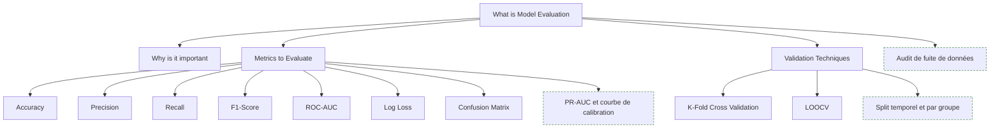

**À quoi ça sert.** C'est la section qui distingue un travail sérieux d'une démonstration. Un protocole d'évaluation faux produit un chiffre flatteur et un modèle qui s'effondre en production, sans qu'aucune alerte ne se déclenche. L'ordre correct est : définir la métrique et le protocole de validation d'abord, entraîner ensuite. L'inverse conduit invariablement à choisir a posteriori la métrique qui arrange.

**Ce qu'il faut savoir**

- **What is Model Evaluation / Why is it important** — estimer la performance sur des données jamais vues. Toute décision prise en regardant le jeu de test le contamine : après trois comparaisons, le test est devenu un jeu de validation.
- **Confusion Matrix / Accuracy** — la matrice de confusion est la vue de base, à lire avant toute métrique agrégée : elle montre quelles classes sont confondues avec quelles autres. L'accuracy, elle, est trompeuse dès que les classes sont déséquilibrées — à 1 % de positifs, prédire toujours « négatif » donne 99 %.
- **Precision / Recall / F1-Score** — la précision mesure le coût des faux positifs, le rappel celui des faux négatifs. Le F1 est leur moyenne harmonique : commode pour comparer, mais il masque le compromis exact et suppose que les deux erreurs ont la même valeur, ce qui est rarement le cas.
- **ROC-AUC / Log Loss** — l'AUC donne la capacité de discrimination indépendamment du seuil, mais reste optimiste sur les classes très déséquilibrées, les vrais négatifs abondants gonflant le score. La log loss pénalise les probabilités mal calibrées et pas seulement les erreurs de classe : indispensable si la sortie sert à décider par seuil ou à calculer une espérance de gain.
- **K-Fold Cross Validation / LOOCV** — k découpes et k entraînements donnent une estimation nettement plus stable qu'un simple split ; version stratifiée obligatoire en classification déséquilibrée. LOOCV est le cas limite k = n : biais faible, variance élevée, coût prohibitif, réservé aux très petits jeux.

> [!tip] Ajout 2026
> Trois compléments qui devraient être par défaut : PR-AUC plutôt que ROC-AUC quand les positifs sont rares ; une courbe de calibration pour vérifier qu'une probabilité de 0,8 correspond bien à 80 % de cas positifs ; et la validation croisée imbriquée quand on règle des hyperparamètres — sinon la performance rapportée intègre le tuning et devient optimiste. Pour l'évaluation des systèmes à base de LLM, la même discipline s'applique : voir [[14 - Évaluation]].

> [!warning] Piège
> La fuite de données. Les trois formes les plus courantes : préprocessing ajusté avant le split ; variable calculée à partir d'informations postérieures à l'instant de prédiction ; lignes corrélées réparties entre train et test (même client, même patient, même session). Test de dépistage simple : une performance nettement supérieure aux attentes du métier est presque toujours une fuite, pas une réussite. Chercher la fuite avant de célébrer.

---

## 8. Deep learning

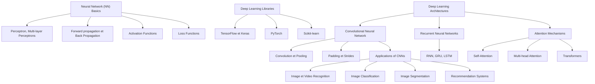

**À quoi ça sert.** Le deep learning domine dès que la donnée est non structurée — image, son, texte — parce qu'il apprend la représentation en même temps que la tâche. Sur du tabulaire de taille moyenne, il reste généralement derrière le gradient boosting pour un coût bien supérieur. La progression MLP → CNN → RNN → attention est une histoire de biais inductif : chaque architecture encode une hypothèse différente sur la structure de la donnée.

**Ce qu'il faut savoir**

- **Perceptron, Multi-layer Perceptrons / Forward propagation / Back Propagation** — empiler des couches linéaires séparées par des non-linéarités ; sans activation non linéaire, toute la pile se réduit à une seule couche. La passe avant calcule sortie et perte, la backpropagation applique la chain rule pour obtenir le gradient par paramètre. Un seul concept ; tout le reste est de l'optimisation.
- **Activation Functions / Loss Functions** — ReLU par défaut et ses variantes (GELU, SiLU dans les architectures récentes) ; sigmoid et tanh saturent et tuent le gradient en profondeur. Cross-entropy en classification, MSE ou Huber en régression (Huber si outliers) : la perte encode l'objectif, la choisir avant l'architecture.
- **PyTorch / TensorFlow / Keras / Scikit-learn** — PyTorch est le standard de fait en recherche et de plus en plus en production ; Keras offre une API de haut niveau agréable sur TensorFlow, encore présent en déploiement historique et embarqué ; scikit-learn n'est listé ici que pour `MLPClassifier`, correct comme baseline mais sans GPU ni contrôle fin.
- **Convolution / Pooling / Padding / Strides** — la convolution exploite la localité et la stationnarité spatiale et partage ses poids ; le pooling réduit la résolution ; padding et stride contrôlent taille de sortie et champ réceptif.
- **Applications of CNNs** — *Image et Video Recognition*, *Image Classification*, *Image Segmentation*, *Recommendation Systems*. La segmentation est le cas dense, une prédiction par pixel, d'où les encodeur-décodeur type U-Net. En recommandation, embeddings d'utilisateurs et d'items puis réseau de scoring : le point difficile est le biais de sélection dans les logs, pas l'architecture.
- **RNN / GRU / LSTM** — traitement séquentiel avec état caché ; les portes du LSTM et du GRU atténuent la disparition du gradient sans lever la contrainte séquentielle qui empêche la parallélisation. La roadmap écrit « LSMT », lire LSTM.
- **Self-Attention / Multi-head Attention / Transformers** — chaque position agrège l'information de toutes les autres, pondérée par une similarité apprise. Plusieurs têtes captent des relations différentes en parallèle. Complexité quadratique en longueur de séquence, mais entraînement entièrement parallélisable — la raison réelle de la victoire sur les RNN.

> [!tip] Ajout 2026
> Trois points que la roadmap de mars 2026 ne couvre pas. Premièrement, on n'entraîne presque jamais un modèle de vision depuis zéro : fine-tuning d'un backbone pré-entraîné, voire simple prompting d'un modèle de segmentation généraliste. Deuxièmement, les architectures à espace d'états (famille Mamba) offrent une alternative à coût linéaire sur séquences longues, avec un compromis en rappel exact — voir [[Le Transformer en passe d'être dépassé]]. Troisièmement, l'entraînement moderne repose sur des briques absentes de cette liste : normalisation (LayerNorm, RMSNorm), connexions résiduelles, AdamW, warmup et décroissance du learning rate, précision mixte. Sans elles, un réseau profond ne converge tout simplement pas.

> [!warning] Piège
> Sortir le deep learning sur un problème tabulaire de quelques dizaines de milliers de lignes. Un LightGBM réglé en une heure fera mieux, s'expliquera plus facilement et se déploiera pour une fraction du coût. Le deep learning se justifie sur du non structuré, sur du très gros volume, ou quand un modèle pré-entraîné existe déjà pour le domaine.

---

## 9. Concepts avancés

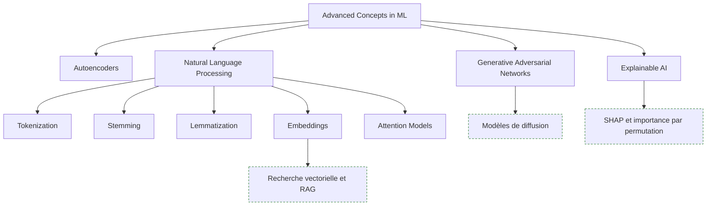

**À quoi ça sert.** Cette dernière section rassemble ce qui déborde du cadre supervisé classique : la génération, l'interprétation et le traitement du langage. C'est aussi la charnière avec la branche LLM du parcours — les embeddings et les modèles d'attention listés ici sont exactement les briques sur lesquelles reposent les systèmes RAG et agentiques.

**Ce qu'il faut savoir**

- **Autoencoders / Generative Adversarial Networks** — compression apprise vers un espace latent puis reconstruction, en version débruitante pour la robustesse ou variationnelle pour un latent génératif continu ; le GAN oppose générateur et discriminateur, avec des échantillons nets mais un entraînement instable (effondrement de mode, non-convergence).
- **Explainable AI** — interprétabilité globale (quelles variables comptent) et locale (pourquoi cette prédiction-ci) ; exigence réglementaire dans le crédit, l'assurance et la santé.
- **Natural Language Processing — Tokenization** — chaîne historique : normalisation, représentation, modélisation. Le découpage en sous-mots (BPE, SentencePiece) a remplacé le mot entier : il élimine le vocabulaire hors-liste et gère la morphologie.
- **Stemming / Lemmatization** — troncature heuristique des suffixes, rapide et approximative, contre réduction à la forme canonique via lexique et analyse grammaticale, plus lente et linguistiquement correcte.
- **Embeddings / Attention Models** — représentation vectorielle dense où la proximité géométrique traduit une proximité sémantique, d'abord statique (Word2Vec, GloVe) puis contextuelle (BERT et successeurs) ; les modèles à attention pré-entraînés servent la classification, l'extraction d'entités et la similarité sémantique.

> [!tip] Ajout 2026
> Les GANs ont largement cédé la place aux modèles de diffusion en génération d'images : entraînement plus stable et meilleure couverture de la diversité. Sur l'interprétabilité, SHAP et l'importance par permutation sont les deux outils à connaître — en gardant en tête que l'importance par permutation devient trompeuse en présence de variables fortement corrélées, puisqu'elle évalue des combinaisons irréalistes. Enfin, stemming et lemmatization ne sont plus utiles dans une chaîne à base de transformers : la tokenisation sous-mot les rend redondants. Ils gardent leur place en recherche lexicale type BM25, qui reste indispensable en hybride dans un RAG — voir [[04 - Chunking, embeddings et rerankers]].

> [!warning] Piège
> Confondre similarité d'embeddings et pertinence. Deux phrases de sens opposé peuvent avoir une similarité cosinus élevée parce qu'elles partagent le même sujet. C'est la raison d'être des rerankers, et la cause la plus fréquente de résultats de retrieval décevants avec un pipeline pourtant correct.

---

## Parcours conseillé

| Ordre | Étape | Effort | À viser |
|---|---|---|---|
| 1 | Introduction et cadrage du métier | ~2 jours | Savoir formuler un problème métier en tâche ML, avec cible et métrique |
| 2 | Fondations mathématiques | ~4 semaines | Lire une formule de perte et un gradient sans blocage ; PCA comprise via la SVD |
| 3 | Python, outillage et préparation des données | ~5 semaines | Un module testé et un pipeline de features reproductible, sans fuite, en Parquet |
| 4 | Cadre ML et scikit-learn | ~2 semaines | Un `Pipeline` complet du CSV brut à la prédiction, avec baseline |
| 5 | Évaluation et validation | ~2 semaines | Protocole choisi avant l'entraînement, résultat rapporté avec intervalle |
| 6 | Apprentissage supervisé | ~4 semaines | Comparer linéaire, forêt et boosting sur un même protocole et savoir arbitrer |
| 7 | Non supervisé et renforcement | ~3 semaines | Une segmentation dont la stabilité est testée ; comprendre PPO sans forcément l'implémenter |
| 8 | Deep learning | ~6 semaines | Entraîner un MLP et fine-tuner un CNN pré-entraîné en PyTorch |
| 9 | Concepts avancés et NLP | ~3 semaines | Classification de texte avec un modèle à attention, explications SHAP à l'appui |
| 10 | Mise en production (hors source) | ~4 semaines | Modèle versionné, servi, monitoré — voir la roadmap MLOps |

L'ordre 5 avant 6 est délibéré : apprendre les algorithmes avant le protocole d'évaluation conduit à mesurer faux pendant des mois.

---

## Liens dans le coffre

- [[02 - Roadmap — AI and Data Scientist]] — recouvrement important sur les fondations ; cette note-ci est plus centrée modélisation, l'autre plus centrée analyse et métier.
- [[08 - Roadmap — MLOps]] — la suite directe : versionnage, serving, monitoring, dérive. Absente de cette roadmap qui s'arrête à la modélisation.
- [[Arbre de Décision Méthodologique]] — choisir la famille de méthode selon la nature des données et de la question, en amont de tout code.
- [[Inférence Statistique et Tests d'Hypothèses]] — le socle qui permet de dire si un écart entre deux modèles est réel.
- [[Classification Automatique (Clustering)]] — approfondissement de la section 6, avec les critères de validation interne.
- [[14 - Évaluation]] — la même discipline appliquée aux systèmes à base de LLM.

## Pour aller plus loin

- *An Introduction to Statistical Learning* — James, Witten, Hastie, Tibshirani. L'entrée la plus efficace ; versions R et Python disponibles gratuitement.
- *The Elements of Statistical Learning* — Hastie, Tibshirani, Friedman. La référence théorique, à consulter par chapitre.
- *Hands-On Machine Learning with Scikit-Learn, Keras and TensorFlow* — Aurélien Géron. Le meilleur pont entre théorie et code.
- *Deep Learning* — Goodfellow, Bengio, Courville, pour les fondations théoriques ; et *Dive into Deep Learning* — Zhang, Lipton, Li, Smola, libre et avec code exécutable en PyTorch.
- *Reinforcement Learning: An Introduction* — Sutton et Barto. La référence unique du domaine, disponible gratuitement.
- *Interpretable Machine Learning* — Christoph Molnar. Libre en ligne, couvre SHAP, LIME et les limites de chaque méthode.
- Tutoriels officiels PyTorch (pytorch.org) et guide utilisateur scikit-learn — le second, partie « Model selection and evaluation », vaut d'être lu intégralement.
