> [!abstract] Construire des produits sur des modèles pré-entraînés : APIs, prompt et context engineering, embeddings, RAG, agents, MCP, multimodal, sécurité et mise en production — pour un ingénieur qui veut livrer, pas entraîner un modèle.

## En un coup d'œil

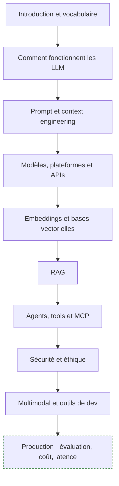

Pré-requis de la roadmap : « one of these », c'est-à-dire savoir déjà développer côté backend ou frontend. Un AI Engineer est d'abord un ingénieur logiciel — voir [[parcours/computer-science/index|Parcours Computer Science]] si les bases système manquent.

---

## 1. Introduction et vocabulaire

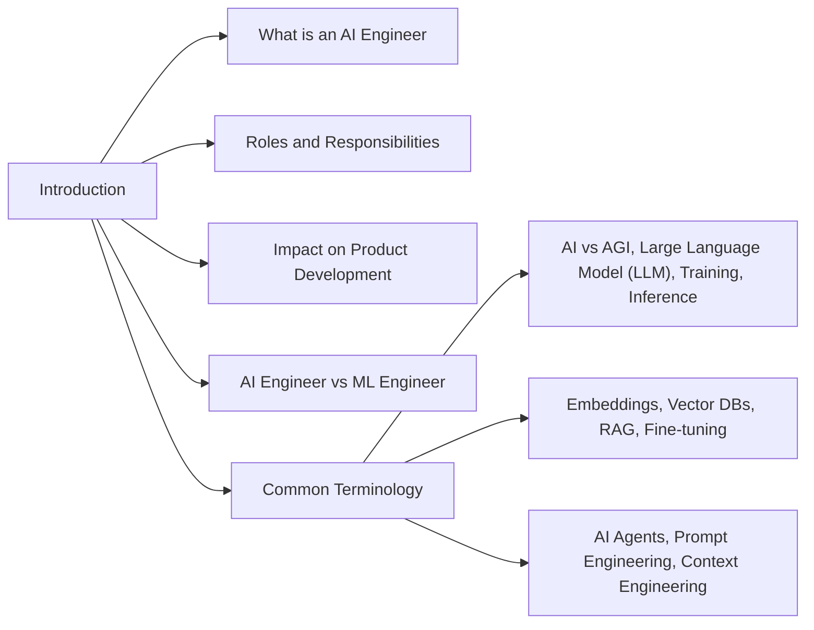

**À quoi ça sert.** La distinction AI Engineer / ML Engineer structure tout le reste du parcours. L'ML Engineer produit un modèle : données, entraînement, métriques, déploiement des poids. L'AI Engineer consomme un modèle déjà entraîné et construit le système autour : récupération du contexte, orchestration, garde-fous, coût, latence, interface. L'impact sur le développement produit est là — le cycle passe de « collecter un dataset » à « écrire un prompt, mesurer, itérer en heures ».

**Ce qu'il faut savoir**

- AI vs AGI — vocabulaire de conférence, aucune incidence sur l'ingénierie ; le reste du glossaire, si.
- Training vs inference — tu ne fais que de l'inference. Le fine-tuning modifie le style et le format, pas la connaissance factuelle à jour.
- Embeddings et vector DBs — la brique de récupération : transformer du texte en vecteurs et chercher par similarité.
- RAG — donner le bon contexte au moment de la requête plutôt que l'apprendre au modèle.
- Prompt engineering vs context engineering — le premier écrit les instructions, le second décide de ce qui occupe la fenêtre.

> [!tip] Ajout 2026
> Le titre recouvre aujourd'hui deux métiers : celui qui câble des APIs et des pipelines RAG (produit, itération rapide) et celui qui opère de l'inference (vLLM, quantization, batching, GPU). Les offres mélangent les deux, lis la fiche de poste et pas le titre. Voir [[Etat de l'art des modèles IA]].

> [!warning] Piège
> Attaquer par le fine-tuning. Un bon prompt système plus une récupération correcte battent presque toujours un fine-tuning bâclé sur 500 exemples, pour un centième de l'effort et sans dette de ré-entraînement à chaque version de modèle.

---

## 2. Comment fonctionnent les LLM

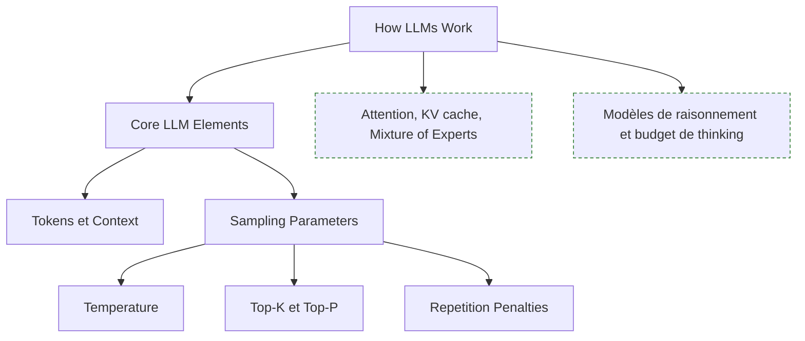

**À quoi ça sert.** Un LLM prédit le token suivant, tout le reste en découle. Pas besoin de dériver la backpropagation, mais il faut comprendre pourquoi un appel coûte ce qu'il coûte et pourquoi il répond ce qu'il répond : le tokenizer explique le prix et les bizarreries sur le code, les chiffres et le français accentué ; le KV cache explique pourquoi le premier token est lent et les suivants rapides.

**Ce qu'il faut savoir**

- Tokens — unité de facturation et de fenêtre. Compte-les avec le tokenizer du fournisseur, jamais en mots divisés par 0,75.
- Context — prompt plus génération. Une fenêtre large ne veut pas dire une attention uniforme : la performance chute au milieu des longs contextes.
- Temperature — 0 pour extraction, classement et JSON ; 0,7 et plus pour de la rédaction.
- Top-K et Top-P — troncature de la distribution. Règle de terrain : ne bouge qu'un seul des trois leviers à la fois.
- Repetition penalties — utile sur les petits modèles ouverts qui bouclent, nuisible sur du code ou du texte structuré où la répétition est légitime.

> [!tip] Ajout 2026
> Les modèles de raisonnement facturent leur chaîne de pensée en tokens de sortie. Sur de l'extraction, activer le raisonnement multiplie le coût sans rien améliorer ; sur de la planification multi-étapes ou du debug, l'écart est net. Traite le budget de raisonnement comme un hyperparamètre à mesurer, pas comme une case à cocher.

> [!warning] Piège
> Croire que temperature 0 rend l'appel reproductible. Le batching côté fournisseur, le routage entre GPU et les mises à jour silencieuses introduisent de la variance. Épingle une version de modèle quand c'est possible et écris des tests tolérants.

---

## 3. Prompt engineering et context engineering

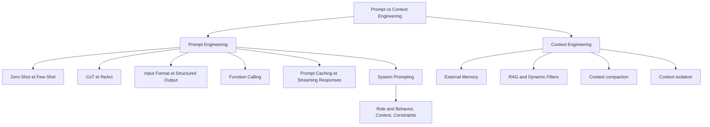

**À quoi ça sert.** Le prompt engineering optimise une instruction ; le context engineering décide de ce qui occupe la fenêtre à chaque tour. Sur une application réelle le second pèse bien plus lourd : un agent qui tourne dix tours voit son contexte se remplir de sorties d'outils, et c'est là que la qualité s'effondre. Le prompt système fixe rôle, comportement et contraintes ; il est stable et se versionne comme du code.

**Ce qu'il faut savoir**

- Zero-shot vs few-shot — trois à cinq exemples bien choisis valent mieux qu'une page de consignes abstraites, surtout pour verrouiller un format.
- CoT et ReAct — CoT fait raisonner avant de répondre, ReAct alterne raisonnement et appel d'outil. ReAct est le squelette de tout agent.
- Input format et structured output — délimite les blocs (balises XML ou Markdown), mets les instructions après les données longues, et impose un schéma JSON côté API plutôt que de le demander dans le prompt.
- Function calling — le modèle renvoie un appel structuré que ton code exécute : même mécanique que le structured output, appliquée aux actions.
- Prompt caching et streaming — les préfixes stables sont facturés bien moins cher en relecture, d'où la règle « stable d'abord, variable ensuite » ; le streaming sauve la latence perçue mais repousse la validation en fin de flux.
- External memory, compaction, isolation, RAG and dynamic filters — sortir l'historique de la fenêtre, le résumer, cloisonner chaque sous-tâche dans son propre contexte, et filtrer la récupération par utilisateur, date et source (c'est aussi le point d'application des droits d'accès).

> [!tip] Ajout 2026
> Trois réflexes de context engineering qui marchent : renvoyer à l'agent un résumé de sortie d'outil plutôt que le blob brut, compacter l'historique dès la moitié de la fenêtre, isoler chaque sous-tâche dans un sous-agent qui ne remonte que sa conclusion. Approfondi dans [[12 - Mémoire et context engineering]].

> [!warning] Piège
> Empiler une consigne à chaque bug jusqu'au prompt système de 4 000 tokens dont personne ne sait quelle ligne fait quoi. Tiens un jeu de cas de test dès le début et supprime toute consigne qui ne fait plus bouger le score.

---

## 4. Modèles, plateformes et APIs

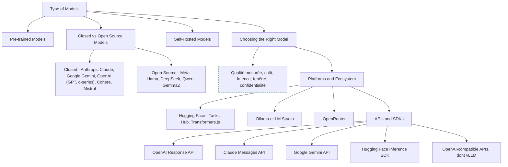

**À quoi ça sert.** Un modèle pré-entraîné est un composant qu'on remplace, pas un choix d'architecture définitif. La décision est un arbitrage à cinq axes — qualité sur tes propres cas, coût, latence, taille de fenêtre, confidentialité — et le débat ouvert contre fermé se tranche souvent sur la dernière ligne : si les données ne peuvent pas sortir, le self-hosted n'est plus une préférence mais une contrainte. La couche plateformes est celle par laquelle passe tout ton trafic.

**Ce qu'il faut savoir**

- Closed vs open source — Claude, Gemini, GPT et o-series, Cohere, Mistral : meilleure qualité de tête de gamme, zéro GPU à gérer, dépendance au fournisseur et à sa politique de dépréciation. Llama, DeepSeek, Qwen, Gemma : contrôle total, coût prévisible à volume élevé, licence à lire réellement avant tout usage commercial.
- Self-hosted — n'a de sens qu'avec un volume soutenu ou une contrainte de confidentialité, sinon le coût GPU à vide dépasse la facture d'API.
- Choisir — construis vingt à cinquante cas représentatifs avec réponse attendue avant de comparer quoi que ce soit ; sans ce jeu tu choisis sur des benchmarks publics qui ne ressemblent pas à ton problème.
- Hugging Face — Tasks pour identifier le type de problème, Hub pour les poids et datasets, Transformers.js pour de l'inference dans le navigateur. Ollama et LM Studio couvrent le poste local, OpenRouter agrège les fournisseurs derrière une clé unique (le moyen le plus rapide de comparer dix modèles).
- OpenAI Response API, Claude Messages API, Gemini API — état conversationnel et outils côté serveur pour la première, blocs de contenu typés et prompt caching explicite pour la deuxième, fenêtre très large et multimodalité native pour la troisième.
- OpenAI-compatible APIs — le standard de fait : vLLM, Ollama, OpenRouter et la plupart des serveurs l'exposent. Écris ton client contre ce schéma et tu changes de backend en changeant une URL de base.

> [!tip] Ajout 2026
> Les familles ouvertes ont comblé une grande partie de l'écart sur l'extraction, la classification et le RAG classique — les tâches où le contexte fait le travail. L'écart persiste sur le raisonnement long et l'usage d'outils en chaîne. Stratégie qui tient : petit modèle ouvert pour le volume, gros modèle fermé pour les cas durs, routage explicite. Voir [[Modèles locaux sous 24 Go de VRAM]] et [[Tutoriel - vLLM - concepts, déploiement, paramétrage et intégrations]].

> [!warning] Piège
> Câbler un fournisseur en dur dans le code applicatif, et oublier retry avec backoff, timeout et plafond de dépense. Les 429 arrivent le jour de la démo, et les gains de coût se prennent en changeant de modèle, pas en polissant les prompts.

---

## 5. Embeddings et bases vectorielles

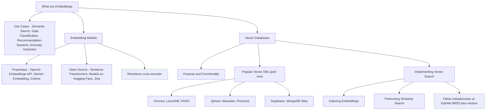

**À quoi ça sert.** Un embedding projette un texte dans un espace où la proximité géométrique approxime la proximité de sens : c'est ce qui permet de chercher « comment annuler mon abonnement » et de trouver un document qui parle de « résiliation ». La base vectorielle stocke ces vecteurs avec leurs métadonnées et répond aux k plus proches en temps sous-linéaire via un index HNSW ou IVF. Le « pick one » de la roadmap est le bon conseil : les APIs se ressemblent, la migration est peu coûteuse, l'important est de commencer.

**Ce qu'il faut savoir**

- Semantic search, classification, recommandation, détection d'anomalie — quatre usages, une seule opération : produire un vecteur puis comparer par cosinus. Un classifieur linéaire sur embeddings est souvent plus rapide, moins cher et plus stable qu'un appel LLM par ligne.
- Modèles propriétaires vs ouverts — OpenAI, Gemini, Cohere sans infra et au token ; Sentence Transformers, le Hub et Jina gratuits à l'inference et exécutables sur CPU en petite taille.
- Dimension et métrique — la dimension pilote le coût de stockage et de recherche ; la métrique doit correspondre à celle de l'entraînement, cosinus dans la grande majorité des cas.
- Choix du store — FAISS est une bibliothèque, pas une base : ni persistance ni filtrage transactionnel, imbattable en local pour expérimenter. Chroma et LanceDB sont embarqués, Qdrant et Weaviate sont des serveurs complets, Pinecone est managé. Avec Supabase (pgvector) ou MongoDB Atlas l'index vit à côté des données métier : une seule base à sauvegarder, jointures possibles, souvent le choix le plus raisonnable quand la stack existe déjà.
- Indexing et similarity search — les paramètres d'index arbitrent rappel contre latence ; mesure le rappel contre une recherche exhaustive sur un échantillon.

> [!tip] Ajout 2026
> Sur du français : choisis un modèle réellement multilingue plutôt qu'un modèle anglophone en tête de classement, utilise les représentations de type Matryoshka pour tronquer la dimension sans réindexer, et ajoute un reranker cross-encoder sur le top 50 — il apporte plus de gain que n'importe quel changement d'embedder. La recherche hybride BM25 plus dense, fusionnée par Reciprocal Rank Fusion, corrige les échecs sur références exactes et acronymes. Détails dans [[04 - Chunking, embeddings et rerankers]] et [[05 - Stores et index]].

> [!warning] Piège
> Changer de modèle d'embedding sans tout réindexer, et ne pas prévoir la suppression : les vecteurs ne sont pas comparables entre familles, et un document réindexé sans purge laisse des chunks fantômes qui remontent des informations périmées. Stocke la version du modèle à côté de chaque vecteur et fixe une clé stable par document.

---

## 6. RAG

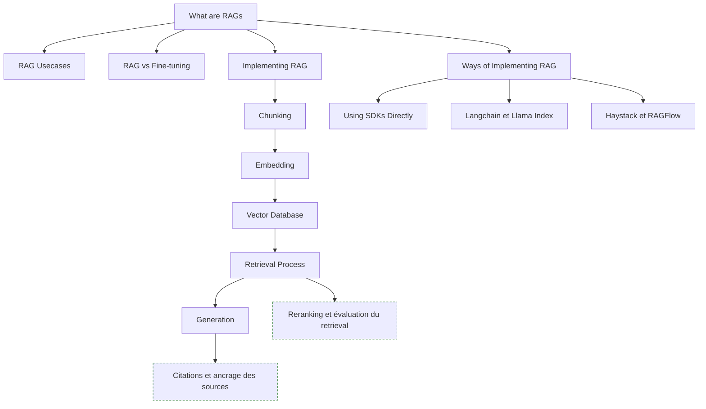

**À quoi ça sert.** Le RAG fait parler le modèle de données qu'il n'a jamais vues sans toucher aux poids. Le pipeline canonique est linéaire — découper, vectoriser, indexer, récupérer, générer — et chaque étage peut faire échouer l'ensemble. En pratique la quasi-totalité des mauvaises réponses vient du retrieval : si le bon passage n'est pas dans le contexte, aucun modèle ne le devinera.

**Ce qu'il faut savoir**

- RAG usecases et RAG vs fine-tuning — support client sur base documentaire, recherche interne, assistance réglementaire, analyse de contrats : un corpus qui bouge et qui doit être cité. Le RAG apporte des faits à jour et traçables, le fine-tuning un style et un vocabulaire métier ; ils se combinent, ils ne se remplacent pas.
- Chunking — la décision la plus structurante. Découpe sur la structure du document (titres, sections) et non sur un nombre de caractères fixe, garde un recouvrement, conserve le titre de section dans chaque chunk.
- Retrieval process — réécriture de requête, hybride, filtres de métadonnées, reranking, puis top k final. C'est là que se gagnent les points.
- Generation — impose la citation des chunks utilisés et la réponse « je ne sais pas » quand le contexte ne contient pas l'information.
- Using SDKs directly — pour un RAG simple, cent lignes de Python suffisent et se déboguent. Commence par là ; LangChain, LlamaIndex (le plus orienté ingestion), Haystack (pipelines explicites) et RAGFlow (application complète avec parsing documentaire) s'adoptent quand tu sais précisément ce que tu leur délègues.

> [!tip] Ajout 2026
> Le RAG naïf a largement cédé la place au RAG agentique : le modèle décide de chercher, reformule, relance une seconde requête, s'arrête quand il a de quoi répondre. Gain net sur les questions multi-sauts, coût et latence en hausse. Le dossier du coffre traite tout cela en profondeur — [[00 - Index — Etat de l'art RAG 2026]], [[03 - Ingestion documentaire]] et [[07 - Retrieval avancé et RAG agentique]].

> [!warning] Piège
> Livrer un RAG sans jeu d'évaluation. Sans une centaine de paires question/passage attendu, tu ne sauras pas si ton changement de chunking a amélioré ou dégradé le système, et chaque itération devient une affaire d'opinion. Mesure le rappel du retrieval d'abord, la génération ensuite — méthode dans [[14 - Évaluation]].

---

## 7. Agents, tools et MCP

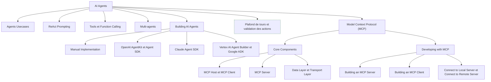

**À quoi ça sert.** Un agent est une boucle : observer, choisir un outil, lire le résultat, recommencer jusqu'à une condition d'arrêt — ReAct en est la formulation classique. L'écart entre une démo et un système fiable tient à la qualité des outils exposés et au traitement des erreurs : un outil dont le message d'erreur est explicite permet au modèle de se corriger seul, un outil qui renvoie une stack trace le fait boucler. MCP standardise cette exposition : un serveur écrit une fois devient consommable par n'importe quel host compatible, au lieu d'un adaptateur maison par fournisseur.

**Ce qu'il faut savoir**

- Agents usecases — support avec accès aux systèmes internes, recherche et synthèse, back-office, assistance au développement.
- Tools et function calling — description claire, schéma de paramètres strict, sortie compacte. Moins de dix outils par agent : au-delà, le taux de sélection correcte s'effondre.
- Multi-agents — un orchestrateur qui délègue à des spécialistes, chacun avec son contexte. Utile pour l'isolation, coûteux en latence, difficile à déboguer : n'y va que si l'agent unique a échoué.
- Manual implementation — écris la boucle toi-même au moins une fois (soixante lignes) ; tu comprendras ensuite ce que masquent OpenAI AgentKit, Claude Agent SDK, Vertex AI Agent Builder et Google ADK, dont le prix est le couplage au fournisseur.
- Condition d'arrêt — nombre maximal de tours, budget de tokens, timeout. Non négociable : un agent sans plafond consomme un budget entier sur une requête.
- MCP host, client, server, data et transport layer — le host embarque le modèle, le client ouvre une connexion par serveur, le serveur expose des tools (actions), des resources (données) et des prompts ; JSON-RPC pour la négociation de capacités, stdio pour un serveur local en sous-processus, HTTP en streaming pour un serveur distant, qui exige lui une authentification et un contrôle d'accès par utilisateur.
- Building a server — la partie facile, quelques dizaines de lignes avec les SDK officiels. Le soin va dans la description des outils : c'est elle que le modèle lit.

> [!tip] Ajout 2026
> La question qui tranche en revue de conception : cet agent a-t-il besoin d'un état durable, ou est-ce un workflow déterministe déguisé ? Beaucoup de projets « agents » sont trois appels enchaînés, mieux servis par du code classique — plus rapide, moins cher, testable. Comparatifs dans [[10 - Frameworks d'agents et orchestration]], [[11 - MCP et interopérabilité]] et [[07 - Roadmap — AI Agents]].

> [!warning] Piège
> Donner des outils d'écriture (e-mail, suppression, paiement) sans validation humaine ni idempotence, et installer des serveurs MCP tiers sans lire leur code. Une hallucination sur un argument devient une action irréversible, et la description d'un outil est du texte injecté dans le prompt.

---

## 8. Sécurité et éthique

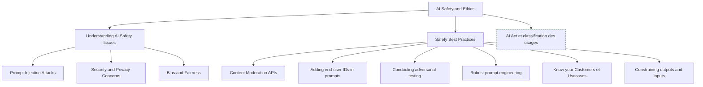

**À quoi ça sert.** Un LLM ne distingue pas les instructions du développeur de celles présentes dans les données qu'il lit. C'est la faille structurelle de toute application LLM et elle n'a pas de correctif définitif : dès qu'un agent lit du contenu non maîtrisé — un e-mail, une page web, un PDF envoyé par un tiers — ce contenu peut contenir des ordres. La défense est architecturale : limiter ce que le système peut faire, pas espérer qu'il ne se laisse pas convaincre.

**Ce qu'il faut savoir**

- Prompt injection — directe (l'utilisateur demande d'ignorer les consignes) ou indirecte (l'ordre est caché dans un document récupéré). La seconde est la dangereuse : données non fiables plus outils d'écriture.
- Security and privacy — un secret placé dans un prompt système est extractible. Anonymise les données personnelles avant l'appel quand c'est possible.
- Bias and fairness — le modèle reproduit les biais de son corpus. Sur toute décision affectant une personne, humain dans la boucle et mesure des écarts par sous-population.
- Content moderation APIs et end-user IDs — filtre en entrée et en sortie, et transmets un identifiant utilisateur au fournisseur : c'est ce qui permet de bloquer un abus sans couper le service entier.
- Adversarial testing et robust prompt engineering — une suite de prompts d'attaque rejouée à chaque changement de prompt ou de modèle, instructions séparées visiblement des données, contraintes rappelées après les données, refus par défaut.
- Know your customers et constraining inputs/outputs — le même modèle est acceptable pour du brouillon marketing et inacceptable pour du conseil médical ; schémas stricts, listes d'autorisation, longueur bornée, validation serveur de toute action proposée.

> [!tip] Ajout 2026
> En Europe, la classification du système au regard de l'AI Act est devenue une étape de cadrage et non une formalité de fin de projet : elle détermine la documentation, la traçabilité et le niveau de supervision humaine exigés. Voir [[16 - Sécurité et gouvernance]].

> [!warning] Piège
> Considérer la sortie du modèle comme sûre parce que l'entrée était filtrée. Toute sortie atteignant un interpréteur — SQL, shell, HTML, appel d'outil — doit être traitée comme une entrée hostile. Le rendu Markdown d'une réponse contenant une image distante est déjà un canal d'exfiltration.

---

## 9. Multimodal et outils de développement

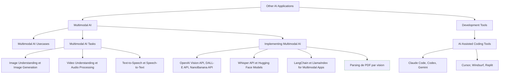

**À quoi ça sert.** La multimodalité élargit le périmètre : lire des documents scannés, décrire des captures d'écran, transcrire des réunions, générer des visuels. Pour un ingénieur RAG l'usage le plus rentable n'est pas la génération d'images mais la compréhension de documents — un modèle de vision lit un tableau dans un PDF là où un extracteur textuel produit une bouillie de colonnes. Les outils de codage assisté, eux, sont le meilleur terrain d'observation des agents : boucle, outils, contexte, condition d'arrêt, tout y est.

**Ce qu'il faut savoir**

- Image understanding — vision API sur captures, schémas et factures ; qualité très dépendante de la résolution envoyée. Image generation (DALL-E API, NanoBanana API) reste marginale en contexte entreprise hors marketing.
- Video understanding, audio processing, speech-to-text et text-to-speech — la vidéo, c'est échantillonnage d'images plus transcription audio, coûteux en tokens et à cadrer serré ; Whisper API transcrit correctement le français mais la diarisation reste à ajouter, et les équivalents ouverts du Hub s'imposent si les données ne peuvent pas sortir.
- LangChain et LlamaIndex pour le multimodal — surtout utiles pour leurs chargeurs de documents et le stockage d'images associées aux chunks.
- Claude Code, Codex, Gemini en CLI vs Cursor, Windsurf, Replit — agents de terminal pour les tâches multi-fichiers guidées par les tests, IDE avec indexation du dépôt pour l'ergonomie d'édition.
- Fichier d'instructions à la racine du dépôt — conventions, commandes de test, architecture : du context engineering appliqué à ton propre code, à versionner. Sans retour d'exécution (tests, typage, linter), un agent produit du code plausible et faux.

> [!tip] Ajout 2026
> Le parsing documentaire par modèle de vision est devenu la référence sur les PDF complexes : rendu de la page en image, extraction en Markdown structuré, tableaux préservés. Plus cher qu'un extracteur classique, mais cela supprime la première source de bruit d'un RAG. Voir [[03 - Ingestion documentaire]] ; pour les agents de code, [[Claude Cheat Sheet]].

> [!warning] Piège
> Envoyer les images en pleine résolution par réflexe (la facturation en tokens image grimpe très vite), et accepter des dépendances ou des schémas de données générés sans les lire. Les erreurs coûteuses ne sont pas des bugs de syntaxe, ce sont des choix d'architecture plausibles découverts trois mois plus tard.

---

## 10. Production : évaluation, coût, latence (hors roadmap)

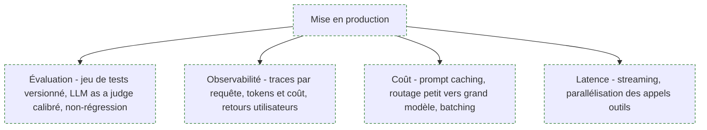

**À quoi ça sert.** La roadmap s'arrête à la construction ; le travail réel commence à la mise en service. Un système LLM n'a pas de « ça marche » binaire : il a une distribution de qualité qui dérive à chaque changement de prompt, de modèle ou de corpus. Sans mesure automatisée, chaque évolution est un pari.

**Ce qu'il faut savoir**

- Jeu de tests versionné — cinquante à deux cents cas avec réponse attendue, dans le dépôt, rejoués en intégration continue.
- LLM as a judge — un modèle qui note selon une grille explicite, à calibrer sur des annotations humaines avant de lui faire confiance.
- Traces — prompt, contexte récupéré, appels d'outils, sortie et latence pour chaque requête. Sans trace, aucun incident n'est reproductible.
- Coût — instrumente les tokens dès le premier jour ; les surprises viennent toujours d'une boucle d'agent ou d'un contexte qui grossit. Prompt caching et routage sont les deux leviers qui ne dégradent pas la qualité.
- Latence — le time to first token compte plus que le temps total pour l'utilisateur : streaming et appels d'outils parallélisés.

> [!tip] Ajout 2026
> Fixe le budget de tokens par requête et par session dans le code, pas dans le tableau de bord de facturation. Un agent en boucle découvert le lendemain matin coûte plus cher que tout le reste du projet. Voir [[14 - Évaluation]] et [[15 - Observabilité et traçabilité]].

> [!warning] Piège
> N'évaluer que la réponse finale d'un système RAG. Si le retrieval échoue, la génération est parfaite sur le mauvais contexte et la note globale ne dit pas où corriger. Mesure chaque étage séparément.

---

## Parcours conseillé

| Ordre | Étape | Effort | À viser |
|---|---|---|---|
| 1 | Vocabulaire et fonctionnement des LLM | ~3 jours | Expliquer tokens, fenêtre, sampling et facturation |
| 2 | APIs et SDKs en conditions réelles | ~1 semaine | Client abstrait, retry, timeout, comptage de tokens |
| 3 | Prompt et context engineering | ~2 semaines | Prompt système versionné, structured output, function calling |
| 4 | Choix de modèle | ~3 jours | Vingt cas de test comparés sur trois modèles |
| 5 | Embeddings et base vectorielle | ~2 semaines | Index sur corpus réel, rappel mesuré, hybride et filtres |
| 6 | RAG de bout en bout sans framework | ~2 semaines | Pipeline avec citations et jeu d'évaluation |
| 7 | Agents et function calling | ~2 semaines | Boucle ReAct écrite à la main, plafond de tours |
| 8 | MCP | ~1 semaine | Un serveur MCP maison branché sur un système interne |
| 9 | Sécurité et prompt injection | ~1 semaine | Suite de tests adverses rejouée en continu |
| 10 | Multimodal et outils de dev | ~1 semaine | Parsing de PDF par vision sur un corpus difficile |
| 11 | Évaluation, coût, observabilité | continu | Traces, budget par requête, non-régression en CI |

---

## Liens dans le coffre

- [[00 - Index — Etat de l'art RAG 2026]] — la porte d'entrée du dossier RAG : tout ce que cette roadmap effleure y est traité en profondeur.
- [[04 - Chunking, embeddings et rerankers]] — choix d'embedder, stratégies de découpe, rerankers et compromis chiffrés.
- [[07 - Retrieval avancé et RAG agentique]] — hybride, fusion, reformulation, boucles de recherche : la suite directe de la section RAG.
- [[10 - Frameworks d'agents et orchestration]] — comparatif des SDK d'agents et critères de choix.
- [[11 - MCP et interopérabilité]] — architecture MCP, sécurité des serveurs, intégration au SI.
- [[18 - Recommandations — stacks types]] — stacks assemblées selon la contrainte dominante (confidentialité, budget, volume).

## Pour aller plus loin

- Documentation officielle des fournisseurs : Anthropic (prompt engineering, tool use, prompt caching), OpenAI (structured outputs, agents), Google (Gemini API). Sources les plus mouvantes et les seules à jour.
- Spécification Model Context Protocol et ses SDK officiels, sur le site du protocole.
- « AI Engineering », Chip Huyen — écrit exactement pour ce profil : évaluation, adaptation de modèles, coût.
- « Designing Machine Learning Systems », Chip Huyen — la partie conception système et boucles de feedback reste la meilleure référence de cadrage.
- Documentation Sentence Transformers pour les embeddings, LlamaIndex et Haystack à lire comme des catalogues de patterns d'ingestion et de retrieval.
- OWASP Top 10 for Large Language Model Applications — la check-list de sécurité à passer avant toute mise en production.
