> [!abstract] Le parcours qui mène du modèle qui marche sur un notebook au modèle qui tourne en production, se met à jour tout seul et se surveille — versioning, CI/CD, orchestration, monitoring, drift, coûts.

## En un coup d'œil

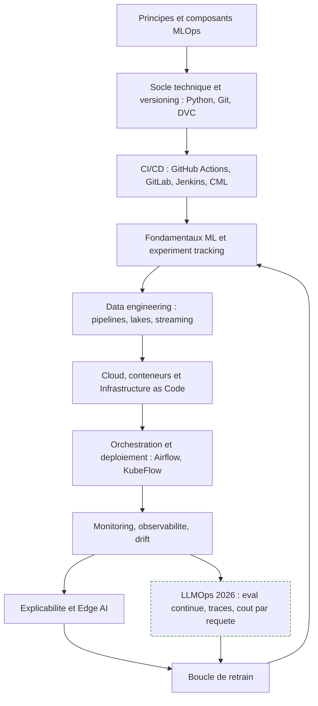

---

## 1. Ce qu'est le MLOps — principes et composants

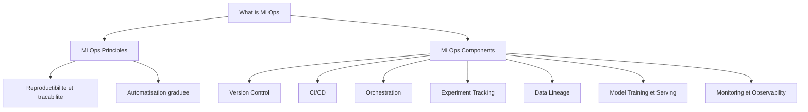

**À quoi ça sert.** Le MLOps existe parce qu'un modèle de ML n'est pas un artefact figé : sa qualité dépend d'un flux de données qui bouge, alors que le code, lui, ne bouge pas tout seul. On applique donc les pratiques DevOps — versioning, tests, livraison continue, supervision — à un système à trois entrées mouvantes : le code, les données et les hyperparamètres. La conséquence pratique est qu'un projet ML porte une dette technique cachée bien supérieure à un projet logiciel classique, et que cette dette se paie en incidents silencieux plutôt qu'en crashs.

**Ce qu'il faut savoir**

- **Reproductibilité** — un run doit être rejouable à partir d'un commit, d'un hash de dataset et d'un fichier de config. Si tu ne peux pas régénérer un modèle de production, tu ne peux pas le déboguer.
- **Automatisation** — l'échelle de maturité usuelle va de « tout à la main » (niveau 0) à « pipeline d'entraînement déclenché automatiquement » (niveau 1) puis « CI/CD du pipeline lui-même » (niveau 2). Viser le niveau 2 partout est une erreur de priorisation ; viser le niveau 1 sur les modèles qui rapportent est le bon arbitrage.
- **Data lineage** — savoir de quelle source, quelle transformation et quelle version de schéma vient chaque feature. C'est ce qui permet de répondre en cinq minutes à « pourquoi le modèle s'est mis à dériver mardi ».
- **Experiment tracking** — un registre des runs (params, métriques, artefacts, code) qui survit au départ de la personne qui a fait l'expérience.
- **Model training et serving** — deux mondes : le training tolère la latence et déteste le coût, le serving tolère le coût et déteste la latence. Les faire cohabiter dans le même code est la première source de train/serve skew.
- **Monitoring et observability** — le monitoring répond « est-ce que ça va mal », l'observabilité répond « pourquoi ». Les deux sont nécessaires.

> [!tip] Ajout 2026
> Le vocabulaire s'est stratifié : **MLOps** (modèles entraînés maison), **LLMOps** (modèles de fondation appelés par API ou servis en local) et **AgentOps** (systèmes multi-étapes avec outils). Les trois partagent le versioning et l'observabilité, mais divergent complètement sur l'évaluation : accuracy hors ligne pour le premier, jury LLM et jeux de régression pour les deux autres. Une organisation qui applique son cadre MLOps tel quel à un système RAG passe systématiquement à côté des vraies défaillances.

> [!warning] Piège
> Construire la plateforme avant le premier modèle en production. La séquence qui marche est inverse : mettre un modèle bête en production le plus tôt possible, souffrir, puis outiller exactement ce qui a fait mal. Les plateformes MLOps construites à vide servent en moyenne un modèle et demi.

---

## 2. Socle technique et versioning

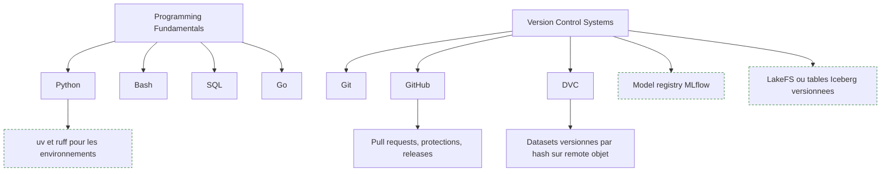

**À quoi ça sert.** Un ingénieur MLOps écrit peu d'algorithmes et beaucoup de colle : Python porte les pipelines et le serving, Bash tout ce qui se passe entre deux conteneurs, SQL la réalité des données bien plus souvent que pandas, et Go apparaît dès qu'on débogue l'écosystème Kubernetes. Le versioning, lui, a trois objets et non un — le code, les données et le modèle produit. Git règle le premier proprement, échoue sur le deuxième (un dataset de 40 Go dans un dépôt est une faute) et n'a rien à dire sur le troisième.

**Ce qu'il faut savoir**

- **Python** — le packaging (pyproject, wheels), le typage progressif et pytest comptent davantage que dix librairies de ML. Un pipeline non testé casse en silence.
- **Bash** — les 20 % utiles : redirections, codes de retour, `set -euo pipefail`, gestion des signaux. Suffisant pour des entrypoints de conteneur corrects.
- **SQL** — fonctions de fenêtrage, CTE, plans d'exécution. Beaucoup de features se calculent mieux dans l'entrepôt que dans un job Spark.
- **Go** — pas obligatoire pour produire, indispensable pour lire le code d'un opérateur Kubernetes ou d'un exporter Prometheus qui se comporte mal.
- **Git et GitHub** — rebase, cherry-pick, bisect ; protections de branche et revue obligatoire. `git bisect` sur des métriques d'évaluation retrouve vite le commit qui a dégradé un modèle. Voir [[Tutoriel - GIT (Cheat Sheet)]].
- **DVC** — `dvc add` sur les données, `dvc repro` pour rejouer un DAG de transformations, `dvc.lock` comme preuve de reproductibilité ; les blobs vivent sur S3, GCS ou Azure Blob et Git ne garde que des pointeurs.
- **Model registry** — un modèle en production a besoin d'un état (staging, production, archived), d'une signature d'entrée/sortie et d'un lien vers son run d'entraînement.

> [!tip] Ajout 2026
> Côté Python, `uv` a unifié résolution de dépendances et environnements (quelques secondes au lieu de minutes, lock reproductible) et `ruff` remplace la pile flake8/isort/black — voir [[Tutoriel -  UV et Python 3.12 sur Windows 11 & WSL]]. Côté données, deux alternatives à DVC ont mûri : **LakeFS** applique la sémantique Git à un bucket objet entier, et **Apache Iceberg**, devenu le format de table de fait, offre du time travel natif — on référence une snapshot ID au lieu de copier des données. Sur gros volumes, Iceberg plus l'identifiant de snapshot dans les métadonnées du run remplace avantageusement DVC.

> [!warning] Piège
> Versionner le fichier de poids sans versionner le code de préprocessing qui va avec. Le modèle rechargé six mois plus tard donne des prédictions absurdes parce que l'ordre des colonnes a changé. Le modèle, son préprocesseur et sa signature forment un seul artefact. Corollaire : le notebook n'est pas un artefact de production — pas d'ordre d'exécution garanti, se diffe mal, état global caché.

---

## 3. CI/CD — et continuous training

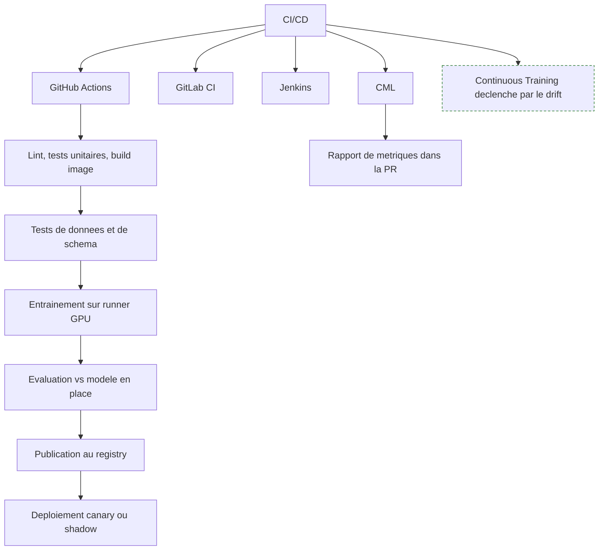

**À quoi ça sert.** En logiciel classique, la CI valide que le code compile et que les tests passent. En ML il faut ajouter deux portes : les données entrantes sont-elles conformes au schéma attendu, et le nouveau modèle est-il meilleur que celui en place sur un jeu de référence figé. Sans ces deux portes, la CI donne une fausse assurance — tout est vert et le modèle est pire.

**Ce qu'il faut savoir**

- **GitHub Actions** — le défaut raisonnable si le code est sur GitHub. Runners auto-hébergés obligatoires dès qu'il faut un GPU.
- **GitLab CI** — supérieur en environnement auto-hébergé et sur les pipelines multi-projets, registry de conteneurs intégré.
- **Jenkins** — encore massivement présent en entreprise. Utile pour brancher un pipeline ML sur une chaîne existante plutôt que d'imposer un nouvel outil.
- **CML (Continuous Machine Learning)** — poste métriques, matrice de confusion et courbes directement dans la pull request. Rendre l'évaluation visible là où la décision se prend, pas dans un dashboard que personne n'ouvre.
- **Tests spécifiques ML** — non-régression sur un golden dataset, test d'invariance (une perturbation qui ne doit rien changer), test directionnel (une perturbation qui doit déplacer la prédiction dans un sens connu).

> [!tip] Ajout 2026
> Le troisième C — **Continuous Training** — s'est standardisé. Le pipeline d'entraînement n'est plus déclenché par un commit mais par un signal : dérive détectée, volume de nouvelles étiquettes atteint, ou calendrier. La règle qui évite les catastrophes : le CT produit toujours un modèle **candidat**, jamais un modèle promu. La promotion reste une décision explicite adossée à une évaluation comparative.

> [!warning] Piège
> Entraîner dans la CI avec un jeu de test qui change à chaque run : la comparaison entre deux modèles n'a alors aucun sens. Le jeu d'évaluation doit être versionné et gelé, avec une procédure de renouvellement délibérée.

---

## 4. Fondamentaux ML et suivi d'expériences

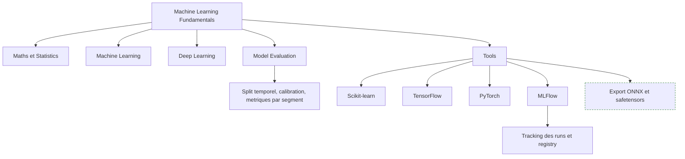

**À quoi ça sert.** Un ingénieur MLOps n'a pas besoin de démontrer un théorème, mais il doit reconnaître un résultat trop beau pour être vrai. Une AUC de 0,99 sur un problème de churn signale presque toujours une fuite de données, pas un bon modèle — et c'est souvent la personne qui met en production qui le voit en premier, parce qu'elle est la seule à regarder le pipeline de bout en bout.

**Ce qu'il faut savoir**

- **Maths et statistiques** — distributions, tests d'hypothèse, intervalles de confiance : nécessaires pour dimensionner un A/B test et interpréter un test de drift sans crier au loup. Voir [[Inférence Statistique et Tests d'Hypothèses]].
- **Machine Learning** — pour le tabulaire, le gradient boosting reste l'état de l'art pratique. Savoir qu'un baseline scikit-learn suffit dans la majorité des cas évite des mois d'infrastructure GPU inutile.
- **Deep Learning** — indispensable pour texte, image, audio et séries multivariées. Côté ops, ce qui compte est le coût mémoire, le batching et la quantification, pas l'architecture.
- **Model Evaluation** — split temporel pour tout ce qui a une dimension chronologique, jamais de split aléatoire ; calibration des probabilités si la sortie alimente une décision seuillée ; métriques ventilées par segment pour repérer les défaillances localisées.
- **Scikit-learn, TensorFlow, PyTorch** — PyTorch domine la recherche et de plus en plus la production, TensorFlow reste dans les stacks historiques et sur mobile via TFLite, scikit-learn reste le meilleur outil pour la moitié des problèmes réels.
- **MLflow** — quatre briques (tracking, projects, models, registry) et le standard de fait, y compris comme couche de compatibilité vers d'autres plateformes.

> [!tip] Ajout 2026
> La sérialisation par pickle est un handicap opérationnel : fragile aux versions, et exécution de code arbitraire au chargement. L'export **ONNX** pour les modèles classiques et **safetensors** pour les poids de réseaux règlent les deux problèmes et découplent l'entraînement du runtime de serving.

> [!warning] Piège
> Optimiser une métrique ML qui n'est reliée à aucune métrique métier. Un gain de trois points de F1 qui ne déplace ni le revenu ni le coût de traitement ne justifie pas un déploiement, mais il crée toujours un risque de régression. Poser la fonction de coût métier avant d'entraîner.

---

## 5. Data engineering — pipelines, lacs, streaming

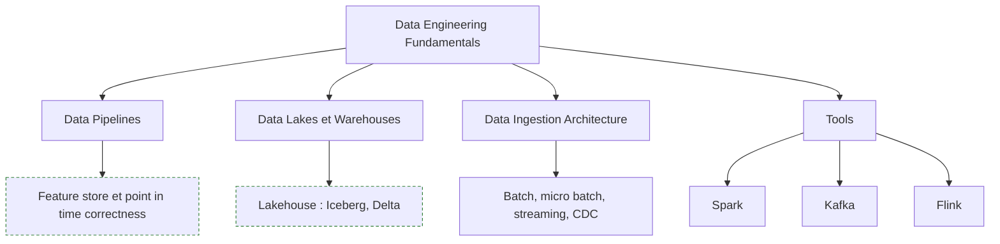

**À quoi ça sert.** La qualité d'un modèle est plafonnée par celle de ses données, et la fiabilité d'un système ML par celle de ses pipelines. En pratique, la majorité des incidents « modèle » sont des incidents « données » : une source qui change de format, un job amont qui échoue en silence, un fuseau horaire mal géré.

**Ce qu'il faut savoir**

- **Data pipelines** — préférer l'ELT (charger brut, transformer dans l'entrepôt) à l'ETL quand le stockage est bon marché : on rejoue les transformations sans réingérer.
- **Data lakes et warehouses** — le lac stocke le brut à bas coût, l'entrepôt sert les requêtes analytiques, le lakehouse fusionne les deux avec des tables transactionnelles sur stockage objet.
- **Data ingestion architecture** — batch, micro-batch, streaming, CDC. Le choix se dérive de la fraîcheur exigée par le cas d'usage, pas de la mode.
- **Spark** — le cheval de bataille du batch distribué, à ne pas dégainer sous 100 Go : DuckDB ou Polars vont plus vite sur une seule machine, pour un coût opérationnel nul.
- **Kafka** — bus d'événements durable, socle du découplage producteur/consommateur. Le registry de schémas est ce qui empêche un producteur de casser tous ses consommateurs.
- **Flink** — traitement de flux avec état et sémantique événementielle correcte (watermarks, fenêtres) ; le bon outil quand les features temps réel doivent suivre les mêmes règles qu'en batch.

> [!tip] Ajout 2026
> Le **feature store** (Feast et équivalents managés) résout un problème précis et coûteux : la *point-in-time correctness*. Le calcul d'une feature à l'entraînement doit voir exactement ce qui était connu à l'instant de la prédiction, sinon on entraîne sur le futur. Sans feature store, on réimplémente cette logique deux fois — une fois en batch, une fois en ligne — et les deux implémentations divergent. C'est la cause numéro un du train/serve skew. Voir [[Pipeline Data]].

> [!warning] Piège
> Les tests de qualité de données en aval du modèle plutôt qu'en amont. Un contrôle de schéma, de plage et de taux de nuls doit s'exécuter à l'ingestion et bloquer le pipeline. Détecter une anomalie de données via les prédictions, c'est la détecter trois jours trop tard.

---

## 6. Cloud, conteneurs et Infrastructure as Code

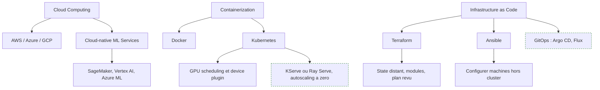

**À quoi ça sert.** Le cloud fournit l'élasticité dont l'entraînement a besoin par à-coups, le conteneur fournit la reproductibilité de l'environnement d'exécution, Kubernetes ajoute l'ordonnancement et le partage de ressources rares — GPU en tête. L'IaC ferme la boucle : sans elle, la production est un artefact non versionné dont personne ne connaît l'état exact, et une préproduction qui ne lui ressemble pas ne teste rien.

**Ce qu'il faut savoir**

- **AWS / Azure / GCP** — les primitives se ressemblent (calcul, stockage objet, IAM, réseau, files). Apprendre profondément un fournisseur puis transposer coûte moins cher que survoler les trois.
- **Cloud-native ML services** — SageMaker, Vertex AI, Azure ML accélèrent le démarrage et enferment durablement. Compromis acceptable pour l'entraînement, plus discutable pour le serving où le verrouillage est le plus coûteux à défaire.
- **Docker** — build multi-stage, utilisateur non root, ordre des couches pour le cache. Une image d'inférence à 8 Go multiplie le démarrage à froid par dix ; images de base slim et wheels CPU-only quand il n'y a pas de GPU font l'essentiel du gain.
- **Kubernetes** — Deployment, Service, Ingress, ConfigMap, Secret, requests/limits. Pour le GPU : device plugin NVIDIA, ressource `nvidia.com/gpu`, et une stratégie de partage (MPS, MIG, time-slicing) quand plusieurs modèles se disputent une carte.
- **Terraform** — state distant avec verrouillage (sinon deux `apply` concurrents corrompent l'état), modules par environnement, lecture systématique du plan : c'est le seul mécanisme de revue que tu auras sur l'infra.
- **Ansible** — idempotence, inventaires, rôles. Toujours utile sur les flottes hors cluster, notamment les serveurs GPU on-premise.
- **Secrets** — jamais en clair dans le state ou les variables : coffre dédié, rôles à durée limitée, OIDC entre la CI et le cloud plutôt que des clés statiques.

> [!tip] Ajout 2026
> Deux pratiques ont fortement baissé la facture : **l'autoscaling à zéro** sur les modèles peu sollicités (KServe, Knative, Ray Serve), où l'on ne paie le GPU que pendant les requêtes, au prix d'un démarrage à froid qu'on atténue en préchargeant les poids sur un volume rapide ; et **les instances spot** pour l'entraînement avec checkpointing régulier, qui divisent le coût des jobs longs à condition que le job sache reprendre. Voir [[Servir modèle à grande échelle]]. Côté déploiement, le **GitOps** s'est imposé : le dépôt décrit l'état désiré du cluster, un contrôleur le réconcilie, la version du modèle servi devient une valeur dans un manifeste versionné — donc un rollback est un `git revert`.

> [!warning] Piège
> Mettre Kubernetes sous un seul modèle à faible trafic : le coût opérationnel du cluster dépasse largement celui d'un conteneur sur une VM. Et surveiller la dérive de configuration — un correctif appliqué à la main via la console, jamais reporté dans le code, casse la production au `apply` suivant.

---

## 7. Orchestration et déploiement

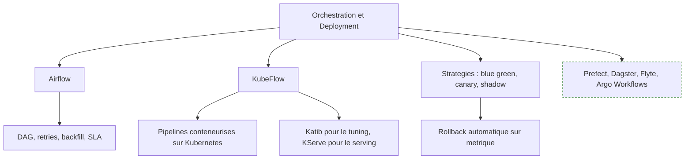

**À quoi ça sert.** Un pipeline ML est une suite d'étapes hétérogènes — extraire, valider, transformer, entraîner, évaluer, publier — dont chacune peut échouer et doit pouvoir être rejouée seule. L'orchestrateur fournit le graphe de dépendances, les reprises, la planification et l'historique. Le déploiement, lui, est le moment où le risque se matérialise : la stratégie choisie détermine combien d'utilisateurs voient un modèle défaillant avant qu'on le retire.

**Ce qu'il faut savoir**

- **Airflow** — le standard historique, très solide pour l'orchestration batch et les backfills. Le piège classique est d'y exécuter le calcul : Airflow doit déclencher des tâches qui tournent ailleurs (Spark, Kubernetes, entrepôt), pas porter la charge.
- **KubeFlow** — pipelines conteneurisés natifs Kubernetes, une image par étape. Coût d'entrée élevé, mais c'est ce qui permet des étapes GPU isolées et un passage à l'échelle propre ; Katib couvre la recherche d'hyperparamètres, KServe le serving.
- **Stratégies de déploiement** — blue/green (deux environnements complets, bascule instantanée, ressources doublées le temps de la bascule) ; canary (1 %, 5 %, 25 %, 100 % avec portes sur les métriques, le défaut raisonnable) ; shadow (le nouveau modèle reçoit le trafic réel, ses réponses sont enregistrées mais pas servies — le seul moyen de valider latence et comportement à risque nul).

> [!tip] Ajout 2026
> Une génération d'orchestrateurs plus adaptés au ML s'est imposée à côté d'Airflow : **Dagster** (assets, typage des entrées/sorties, tests intégrés), **Prefect** (Python natif, faible cérémonie), **Flyte** (fortement typé, pensé pour le ML sur Kubernetes) et **Argo Workflows** (moteur bas niveau utilisé sous KubeFlow). Le basculement conceptuel utile est l'orientation *asset* : on déclare les données et modèles à produire et l'orchestrateur déduit le graphe — plus lisible qu'une DAG de tâches quand la lignée compte. Voir [[10 - Frameworks d'agents et orchestration]] pour l'équivalent côté agents.

> [!warning] Piège
> Déployer sans plan de rollback testé. Revenir en arrière ne se limite pas à l'image précédente : il faut que le préprocessing, le schéma de features et le cache soient compatibles. Un rollback jamais répété est un rollback qui échouera le jour de l'incident.

---

## 8. Monitoring, observabilité et drift

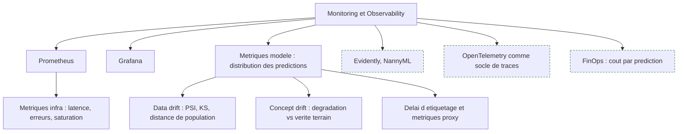

**À quoi ça sert.** Un service ML peut être parfaitement sain du point de vue infra — latence nominale, zéro erreur HTTP — tout en produisant des prédictions devenues fausses. C'est la spécificité du monitoring ML : il faut superviser trois couches, le système, les données et la qualité prédictive, et seule la troisième dit ce qui intéresse le métier.

**Ce qu'il faut savoir**

- **Prometheus** — collecte par scraping, séries temporelles, PromQL. Instrumenter le service d'inférence avec des histogrammes de latence et des compteurs par version de modèle.
- **Grafana** — visualisation et alerting. Un dashboard par modèle avec quatre panneaux : trafic, latence p95, distribution des prédictions, indicateur de drift. Au-delà, personne ne regarde.
- **Data drift** — la distribution des entrées change. Détection par PSI, test de Kolmogorov-Smirnov ou distance de Wasserstein, feature par feature. Alerter uniquement sur les features à forte importance, sinon le bruit noie le signal.
- **Concept drift** — la relation entre entrées et cible change. Ne se détecte qu'avec la vérité terrain, souvent disponible avec des semaines de retard. En attendant, surveiller des proxys : taux d'acceptation, distribution des scores, taux d'appel à une procédure de secours.
- **Cadence de retrain** — se dérive de la vitesse de drift mesurée, pas d'une intuition. Beaucoup d'équipes réentraînent chaque nuit un modèle qui dérive sur six mois, en payant du calcul et en s'exposant à une régression à chaque itération.

> [!tip] Ajout 2026
> **Evidently** et **NannyML** sont devenus les outils par défaut pour le drift, NannyML apportant l'estimation de performance sans vérité terrain — utile précisément quand les labels arrivent tard. **OpenTelemetry** s'est imposé comme socle commun de traces, métriques et logs, ce qui permet de suivre une requête depuis l'API jusqu'à l'inférence dans un seul système — voir [[15 - Observabilité et traçabilité]]. Enfin le **coût par prédiction** est passé au rang de métrique de premier plan, exposée à côté de la latence : une inférence qui coûte plus que la valeur qu'elle produit est un incident, même si tous les voyants sont verts.

> [!warning] Piège
> Alerter sur le drift statistique brut. Sur des volumes importants, n'importe quel test de distribution devient significatif pour un écart sans effet pratique. Coupler taille d'effet et impact estimé sur la métrique métier, sinon l'astreinte apprend à ignorer les alertes du modèle.

---

## 9. Explicabilité et Edge AI

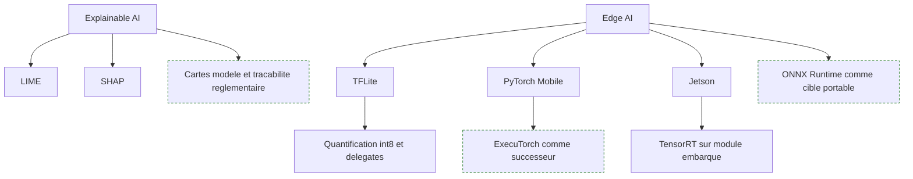

**À quoi ça sert.** L'explicabilité répond à une exigence externe — un client, un auditeur ou un régulateur demande pourquoi une décision a été prise — et à un besoin interne de débogage : les contributions de features révèlent souvent une fuite de données qu'aucune métrique n'avait montrée. L'Edge AI répond à des contraintes de latence, de coût réseau ou de confidentialité : le modèle s'exécute là où la donnée naît, sans aller-retour serveur.

**Ce qu'il faut savoir**

- **LIME** — approxime localement le modèle par un modèle linéaire autour d'un point. Rapide, instable : deux exécutions sur le même point peuvent différer. À utiliser pour explorer, pas pour justifier.
- **SHAP** — valeurs de Shapley, fondées théoriquement et additives, donc agrégables en importance globale. TreeSHAP est exact et rapide sur les modèles à base d'arbres, KernelSHAP est coûteux et approché ailleurs. Rappel utile : une attribution n'est pas une cause, elle dit ce à quoi le modèle réagit.
- **TFLite** — format et runtime pour mobile et microcontrôleurs, avec quantification int8 et délégués matériels (GPU, NNAPI, Core ML).
- **PyTorch Mobile** — la voie PyTorch vers l'embarqué, désormais prolongée par ExecuTorch pour les cibles très contraintes.
- **Jetson** — modules NVIDIA embarqués avec GPU CUDA ; le passage par TensorRT fait la différence entre une démo et un système temps réel.

> [!tip] Ajout 2026
> Sur l'embarqué, **ONNX Runtime** s'est imposé comme cible portable intermédiaire : on exporte une fois et on vise plusieurs runtimes matériels sans réécrire le pipeline. Côté explicabilité, l'entrée en application de la réglementation européenne sur l'IA a déplacé la demande : les auditeurs réclament moins des attributions par prédiction que des **cartes modèle** — usage prévu, données d'entraînement, limites connues, métriques par sous-population — et une traçabilité des versions déployées. Voir [[16 - Sécurité et gouvernance]].

> [!warning] Piège
> Quantifier un modèle pour l'embarqué sans réévaluer sur le jeu de test complet et par segment. La quantification post-training dégrade rarement la métrique globale et souvent lourdement certaines classes rares ou certains sous-groupes.

---

## 10. LLMOps — l'angle mort de la roadmap

> [!tip] Ajout 2026
> Toute cette section est un ajout. La roadmap d'origine, dans sa capture de mars 2026, traite le cycle de vie des modèles entraînés maison et ne dit presque rien du cas devenu majoritaire en entreprise : un système bâti sur des modèles de fondation appelés par API ou servis en local. Les principes MLOps y survivent, les mécaniques changent.

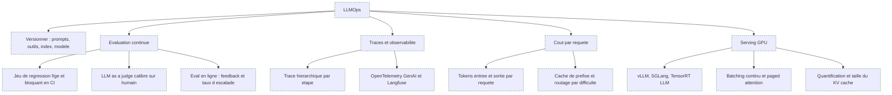

**À quoi ça sert.** Un système à base de LLM n'a pas de fonction de perte en production et pas d'accuracy calculable sur le trafic réel. Sa qualité est un jugement, sa surface de défaillance est textuelle, et son coût est variable par requête au lieu d'être amorti dans un serveur qui tourne. Ces trois différences suffisent à rendre le tableau de bord MLOps classique inopérant.

**Ce qu'il faut savoir**

- **Ce qui remplace le versioning de modèle** — un déploiement est désormais un tuple : version de prompt, version du modèle sous-jacent (qui peut changer sous toi côté fournisseur), version des définitions d'outils, snapshot de l'index vectoriel, paramètres de retrieval. Épingler la version exacte du modèle et journaliser les cinq composantes à chaque requête est le minimum pour pouvoir expliquer une régression.
- **Évaluation continue** — trois niveaux cumulatifs. Un jeu de régression figé de quelques centaines de cas annotés, rejoué à chaque changement avec un seuil bloquant en CI. Un jury LLM pour les critères qualitatifs, dont l'accord avec des annotations humaines doit être mesuré avant qu'on lui fasse confiance — sinon on automatise un biais. Une évaluation en ligne à partir de signaux implicites : reformulations, abandon, escalade vers un humain, correction manuelle du résultat. Voir [[14 - Évaluation]].
- **Traces** — l'unité d'observabilité n'est plus la requête mais l'arbre d'exécution : décomposition de la question, appels de retrieval, appels d'outils, générations intermédiaires. Sans trace hiérarchique, diagnostiquer une mauvaise réponse dans un système RAG ou agentique est impossible. Les conventions GenAI d'OpenTelemetry se sont diffusées et Langfuse fait office d'implémentation courante.
- **Coût par requête** — c'est la métrique qui décide de la viabilité économique. Leviers par ordre de rendement : cache de prefix sur les parties stables du prompt (instructions système, documents récurrents), routage par difficulté vers un petit modèle avec escalade en cas d'échec, compression du contexte, et réduction du nombre d'allers-retours dans les boucles agentiques. Une boucle agentique mal bornée multiplie le coût par dix sans améliorer la réponse.
- **Serving GPU** — vLLM et SGLang ont généralisé le batching continu et la paged attention, qui décorrèlent le débit de la longueur des séquences. Les leviers de capacité sont la quantification des poids, la taille du KV cache (souvent le vrai facteur limitant en mémoire, pas les poids), la longueur de contexte maximale autorisée et le degré de parallélisme tensoriel. Voir [[Tutoriel - vLLM - concepts, déploiement, paramétrage et intégrations]] et [[13 - Serving et infra locale]].
- **Sécurité opérationnelle** — la surface d'attaque est le texte : prompt injection via un document ingéré, exfiltration de contexte, appel d'outil détourné. D'où des garde-fous en entrée et en sortie, un principe de moindre privilège sur les outils, et une journalisation des appels d'outils comme on journalise des appels de base de données.

> [!warning] Piège
> Faire du jury LLM la seule mesure de qualité et ne jamais le calibrer. Les jurys favorisent les réponses longues, bien structurées et confiantes — y compris fausses. Sans un échantillon annoté humainement qui mesure l'accord juge/humain, et sans réétalonnage à chaque changement de modèle juge, la courbe de qualité monte pendant que le produit se dégrade.

> [!warning] Piège
> Traiter le passage d'un modèle propriétaire à sa version suivante comme une mise à jour transparente. Les prompts sont surajustés à un modèle donné ; un changement de version se traite comme un déploiement de modèle à part entière, avec canary et jeu de régression.

---

## Parcours conseillé

| Ordre | Étape | Effort | À viser |
|---|---|---|---|
| 1 | Principes MLOps et composants | ~3 jours | Savoir situer un projet sur l'échelle de maturité 0/1/2 |
| 2 | Socle technique : Python, Bash, SQL | ~2 semaines | Projet packagé avec uv, tests pytest, image Docker qui tourne |
| 3 | Version control : Git, GitHub, DVC | ~1 semaine | Un dépôt où un commit suffit à rejouer un entraînement |
| 4 | CI/CD : GitHub Actions et CML | ~2 semaines | Pipeline qui teste les données, entraîne, compare et publie |
| 5 | Fondamentaux ML et MLflow | ~2 semaines | Tous les runs tracés, un registry avec états et signatures |
| 6 | Data engineering : pipelines, Spark, Kafka | ~3 semaines | Ingestion validée par contrat de schéma, lignée lisible |
| 7 | Cloud et conteneurisation | ~3 semaines | Un modèle servi sur Kubernetes avec sondes et limites de ressources |
| 8 | Infrastructure as Code : Terraform, Ansible | ~2 semaines | Environnement recréé de zéro par un apply |
| 9 | Orchestration : Airflow ou Dagster, KubeFlow | ~3 semaines | DAG de retrain rejouable, backfill maîtrisé |
| 10 | Monitoring et drift : Prometheus, Grafana, Evidently | ~2 semaines | Alertes drift reliées à une métrique métier, pas au bruit |
| 11 | Déploiement progressif : canary et shadow | ~1 semaine | Rollback répété au moins une fois pour de vrai |
| 12 | Explicabilité et Edge AI | ~1 semaine | SHAP sur le modèle en place, un export ONNX quantifié évalué |
| 13 | LLMOps : eval, traces, coût, serving | ~4 semaines | Jeu de régression bloquant en CI et coût par requête au dashboard |

Si tu es déjà data scientist, l'ordre utile est 3, 4, 7, 9, 10 puis 13 — les étapes 5 et 6 seront des révisions.

---

## Liens dans le coffre

- [[Pipeline Data]] — la couche data sur laquelle repose tout le reste ; feature store et point-in-time correctness s'y rattachent directement.
- [[15 - Observabilité et traçabilité]] — le prolongement de la section 8 côté systèmes LLM, avec les traces et les conventions OpenTelemetry.
- [[14 - Évaluation]] — les protocoles d'évaluation hors ligne et en ligne qui alimentent les portes de la CI.
- [[13 - Serving et infra locale]] — dimensionnement GPU, quantification et KV cache pour la partie serving de la section 10.
- [[Servir modèle à grande échelle]] — stratégies de scaling, autoscaling à zéro et arbitrages de coût.
- [[16 - Sécurité et gouvernance]] — garde-fous, cartes modèle et exigences réglementaires évoquées aux sections 9 et 10.

Roadmaps voisines : [[03 - Roadmap — Data Engineer]] pour la couche pipelines et streaming, [[parcours/machine-learning/index|le parcours Machine Learning]] pour les fondamentaux modélisation, [[05 - Roadmap — AI Engineer]] pour la partie applicative LLM, [[07 - Roadmap — AI Agents]] pour l'orchestration agentique dont le LLMOps hérite les problèmes de coût.

## Pour aller plus loin

- *Designing Machine Learning Systems*, Chip Huyen — la référence sur l'architecture des systèmes ML en production, drift et feature stores compris.
- *AI Engineering*, Chip Huyen — le pendant pour les systèmes bâtis sur modèles de fondation : évaluation, coût, adaptation.
- *Machine Learning Design Patterns*, Lakshmanan, Robinson et Munn — catalogue de patterns concrets sur le serving et la reproductibilité.
- *Reliable Machine Learning*, O'Reilly — le ML vu par la culture SRE : SLO, astreinte, post-mortems.
- *Hidden Technical Debt in Machine Learning Systems*, Sculley et al., NeurIPS 2015 — l'article fondateur : le code du modèle est la petite partie du problème.
- *Rules of Machine Learning*, Martin Zinkevich (Google) — les règles empiriques de mise en production, toujours valables.
- *Continuous Delivery for Machine Learning*, Sato, Wider et Windheuser (martinfowler.com) — la référence sur la CI/CD appliquée au ML.
- Documentations officielles à garder sous la main : MLflow, DVC, Airflow, Dagster, Kubeflow, KServe, Terraform, Prometheus, Evidently, vLLM.
