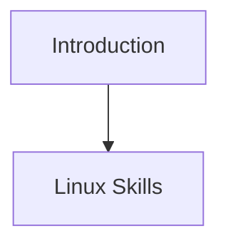

# Parcours FDE

## Approche 1 — mermaid click

## Approche 2 — svg maison

<svg xmlns="http://www.w3.org/2000/svg" viewBox="0 0 400 60" width="400" height="60" role="img">
  <a href="notions/cadrage-besoin"><rect x="10" y="10" width="180" height="40" fill="#eee" stroke="#333"/><text x="100" y="35" text-anchor="middle">Cadrage du besoin</text></a>
</svg>
